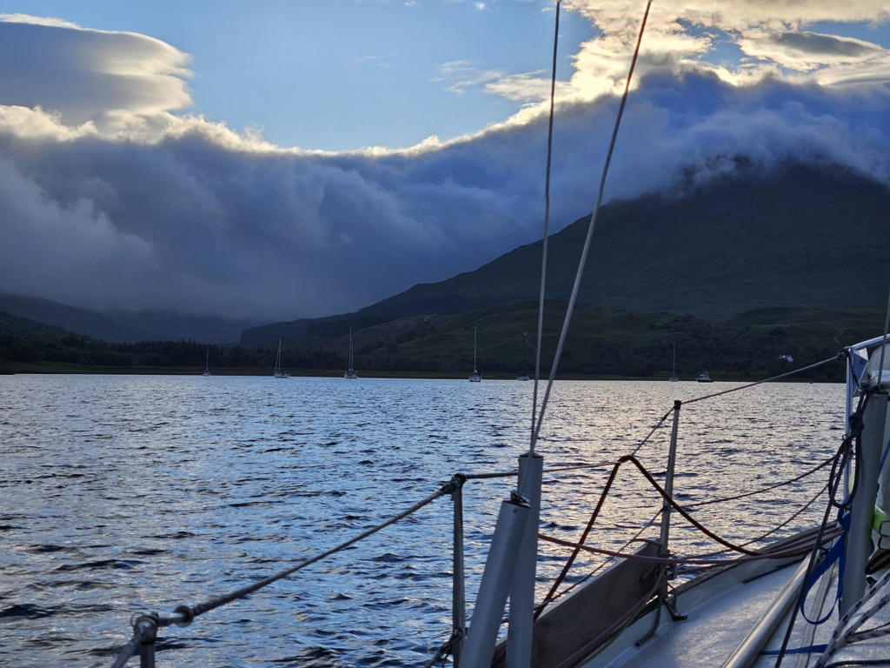

We hoisted the anchor at eight, along with a ginormous ball of seaweed, kelp and mud. As we were on a schedule we motored to Oban so Miisa and Phil could catch their flight back home. After we had tied up it was time to grab a shower.

At 1pm we got our next guest, Martin. We had a pub lunch and did some sightseeing. A plan emerged do some sailing still today and go anchoring for the night. 

The chosen anchorage for tonight was the big and sheltered Loch Spelve. The charts were clear that we should enter at slack tide, and so we were to hit the mouth of the Loch at 20:17. We set up sail 18 and proceeded to make too good of a speed towards our target. Luckily wind died as we got into the shadow of Mull, and we could proceed drifting with the dying tide.

 

We timed the entrance pretty much perfectly and got through without issues. After checking out our initially planned cove, we ran into some katabatic winds and decided to reroute ourselves to the bigger and more protected Lussa River anchorage. This one is quite deep, and was quite full. But being the small boat, there was a nice spot left near the drying area.

 

* Distance today: 21.1 NM
* Total distance: 1638.5 NM
* Lunch today: Haggis burger
* Engine hours: 3.9
