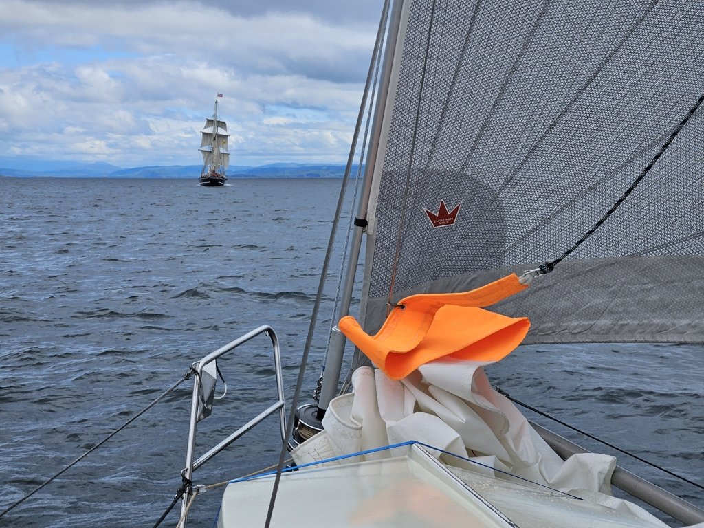

After a fun night at anchor, the day dawned with a new mission: to hunt and catch up with the Brigantine [_Lady of Avenel_](https://www.ladyofavenel.com/).

We timed out our exit from the Loch to low water slack, and then hoisted sail in the lee of Mull. Then we headed west along the coast, where our reconnaissance information told the tall ship would be anchored.

 

At 12:30 we could finally see some square sails in the horizon. We waited for our quarry to pass us, and then turned into pursuit. Replacing the staysail with the genoa and shaking the reef, we could just keep up with the bigger vessel!

Eventually the sporty, sunny sail ended in the Oban marina. We'll spend the evening here with the _Avenel_ crew and then head out again.

* Distance today: 36.2NM
* Total distance: 1674.7NM
* Lunch: lentil coconut curry
* Engine hours: 2
