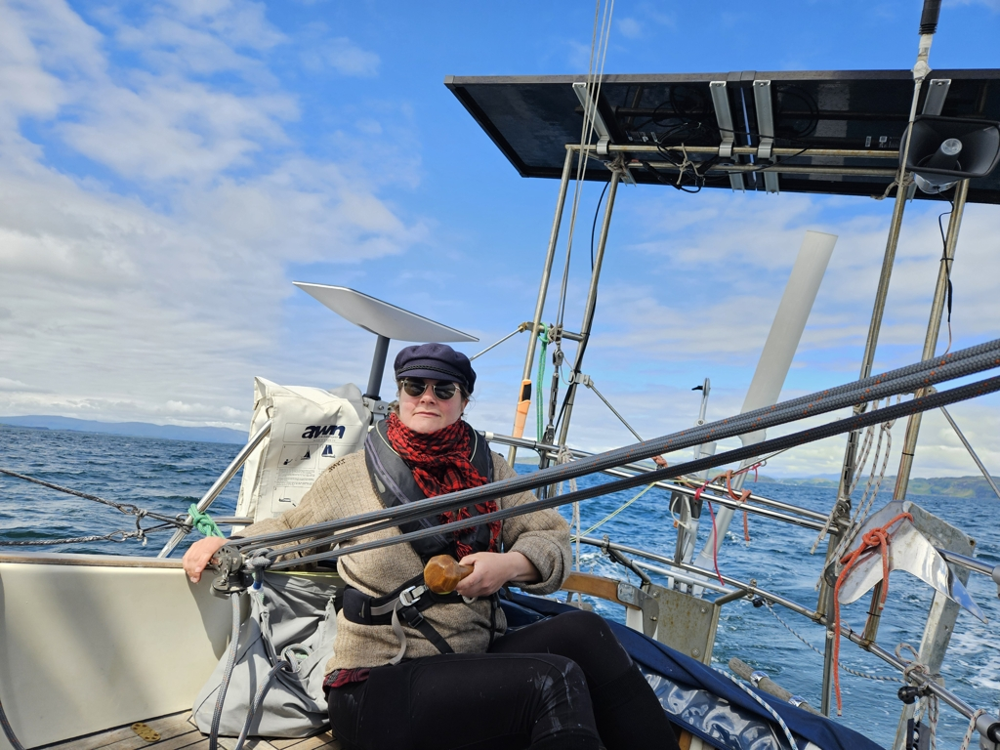

After a night of whisky and song at _Lady of Avenel_, we departed at 13 to catch our next anchorage at high slack. We hoisted the sails just outside of the harbour and proceeded to Kerrera Sound. In Oban bay area it is advisable to listen on the channel 12 for the comings and goings of the ferries. As we were in the sound one of them radioed they were coming in where we were sailing, so we waited in the nearby bay sailing back and forth for the ferry to pass. 

 

Today our attitude towards sailing was a very chilled one. We roughly pointed the nose to the direction we wanted to go and roughly set the sails to match. No fine-tuning or trying to get the last fraction of a knot of speed. Just cruising along in the relative warmness and sun.

The Eilean Dubh anchorage is tight. We dropped our anchor dead center and have just about enough swing room for us. 

 * Distance today: 14.5 NM
 * Total distance: 1689.2 NM
 * Lunch today: Avocado pasta
 * Engine hours: 0.4
