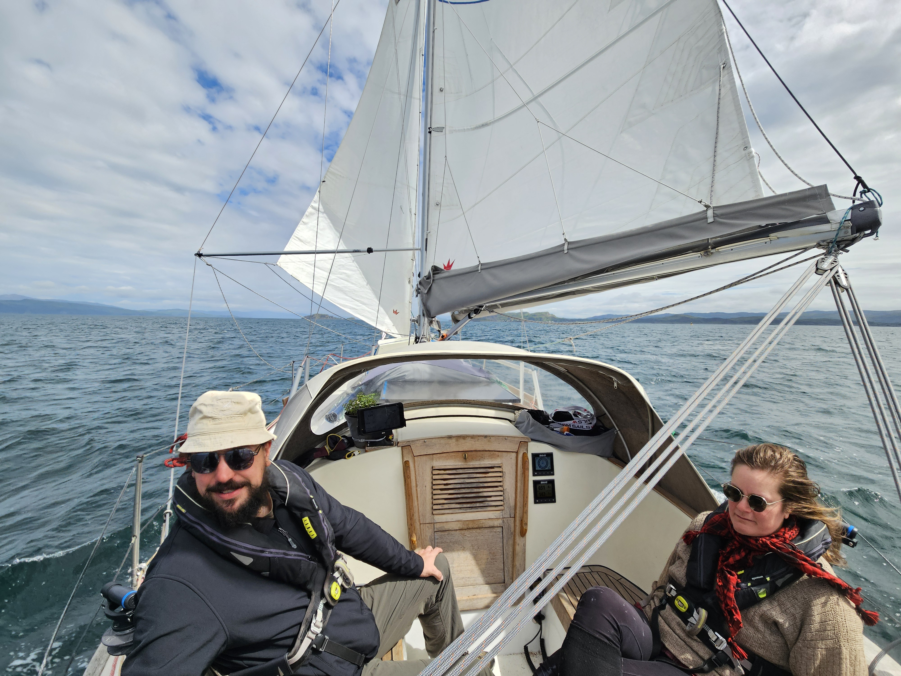
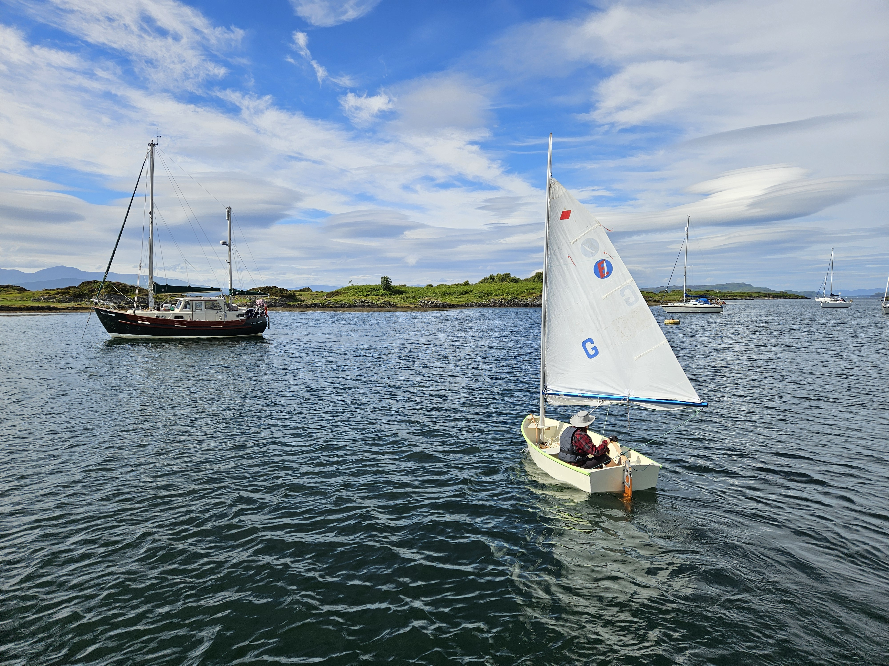
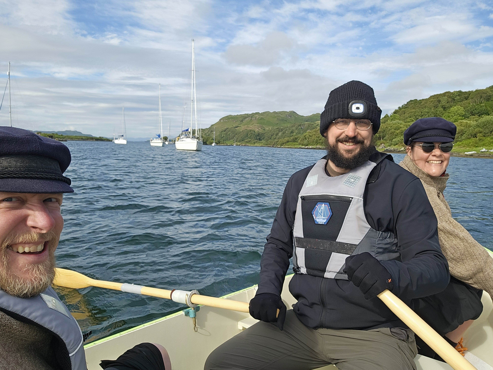

Today's target was the famous anchorage at "The pool of the Otter". We hoisted anchor and sailed through the tidal eddies out of the Black Isles anchorage. Then an easy broad reach down to Puilladobhrain.

 

This is supposed to be one of the best three anchorages in the world - though given that all three are located around Oban, one might expect some bias in the selection. That said, it is a pretty little bay, even with the dozen-or-so sailboats we share the anchorage with.

Having arrived early gave ample time for some recreation. Suski went zooming around the anchorage on the sailing dinghy, while we figured out how to receive WeatherFax on the HF receiver. 

 

Then it was time to row the party over to the shore and hike across the hill to see the "bridge across the Atlantic", and visit the traditional pub of Tigh an Truish ("the house of trousers"). It is now proven that Isosaari can easily carry three adults to an adventure. 

 

* Distance today: 8.8NM
* Total distance: 1698NM
* Lunch: feta salad
* Engine hours: 0.8
