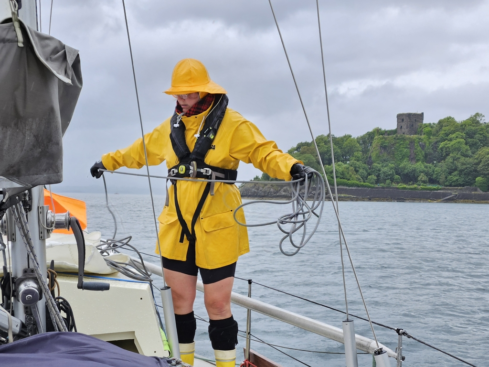
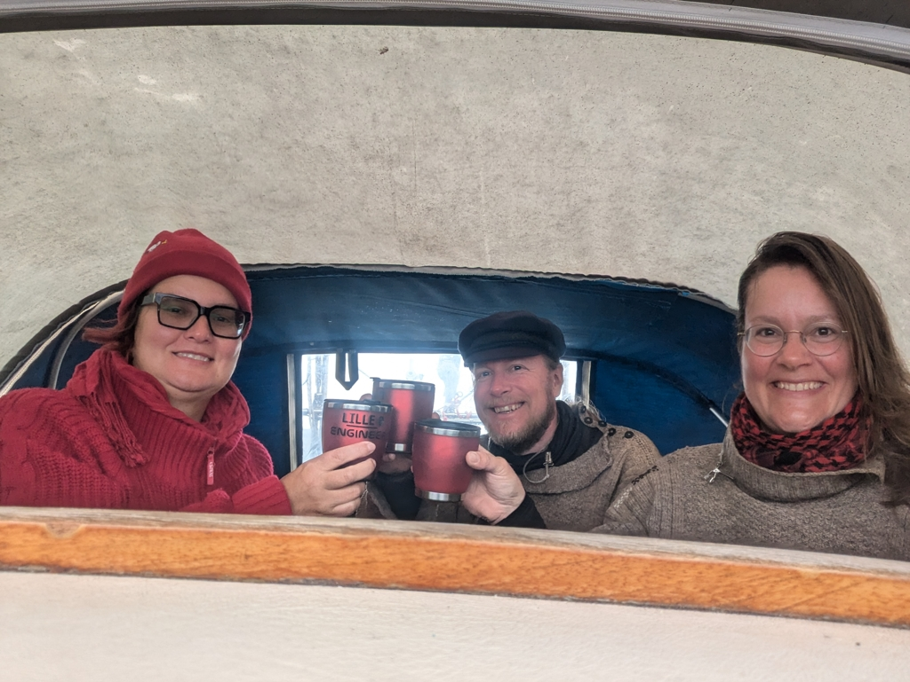

Midsummer day started grey and rainy, but also with a good wind direction. After coffee, we motored out of the marina and hoisted sail inside the Oban Bay.

 

Then across to the Sound of Mull, where we had timed things so that we'd carry a favourable current the whole day. Going wing-on-wing we even passed a couple of bigger sailboats.

We passed Cape Ardnamurchan with a speedy 2.5kt current, and tucked ourselves to behind the reefs at Sanna Bay. Now it is a bit rolly here, but we hope that to subside on low tide when more of the reef is between us and the sea.

Conditions for this Scottish Midsummer are probably apparent from the fact that we're having glühwein for anleger. Kippis!

 

* Distance today: 36NM
* Total distance: 1741.1NM
* Lunch: cous cous salad
* Engine hours: 0.5
