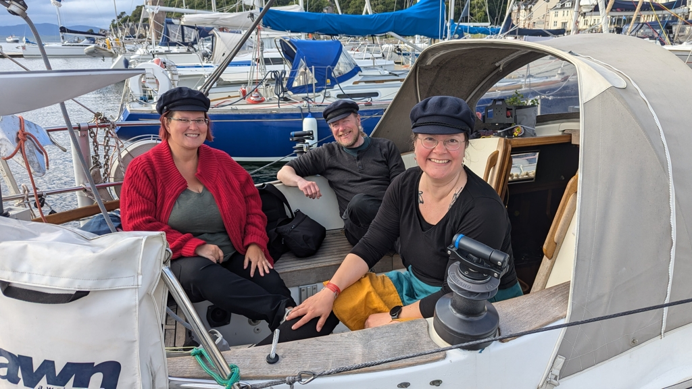

No tides to wait this time, so we left after we had woken up and had breakfast. We weaved our way out between the anchored boats and hoisted the sails just outside the bay. There was not much wind, so we slowly blobbed wing on wing with a poled out head sail. At the Kerrera Sound the wind died completely, so we motored the rest of the way. 

 

In Oban we had plenty to do, laundry, groceries and crew swap. Martin headed home and in return we got Karin! Now it is time to head north again and hopefully reach escape velocity from Oban.

* Distance today: 7.1NM
* Total distance: 1705.1NM
* Lunch: mussels 
* Engine hours: 1.5
