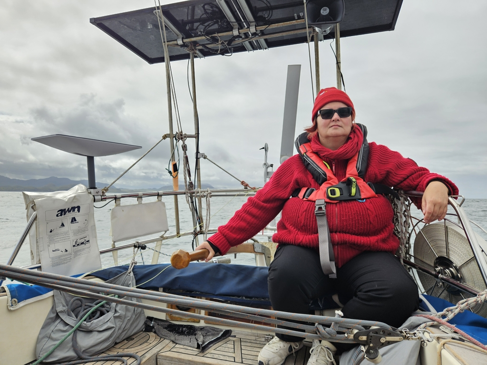

With no significant tide to deal with, we decided to wake up without an alarm. Around nine we were all up and ready for a breakfast. Luckily the rain had already stopped, so we could enjoy the scenery on the back deck. After breakfast it was sails up and on a downwind course towards Isle of Rum.

 

The gentle swell of Atlantic pushed us along in the ever increasing wind. But as we had prepared the 1st reef and staysail we were not in trouble.  Small rain clouds kept hiding one or the other of the Small Isles but luckily we got no rain. 

Now we are tucked in the bay in a visitor mooring and are ready for lunch. And some rum on Rum.

 

* Distance today: 18.3NM
* Total distance: 1759.4NM
* Lunch: paneer curry
* Engine hours: 0.5
