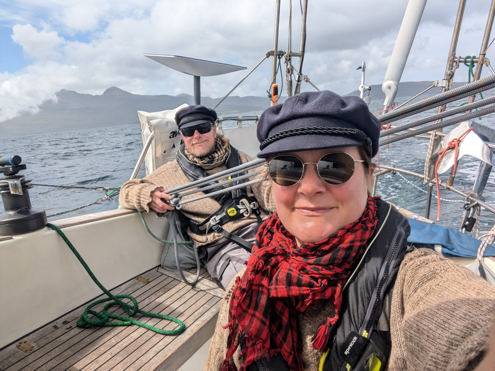
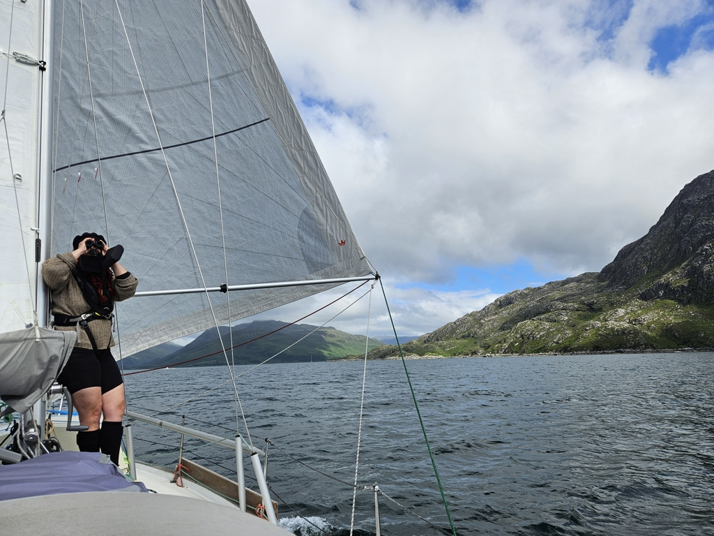
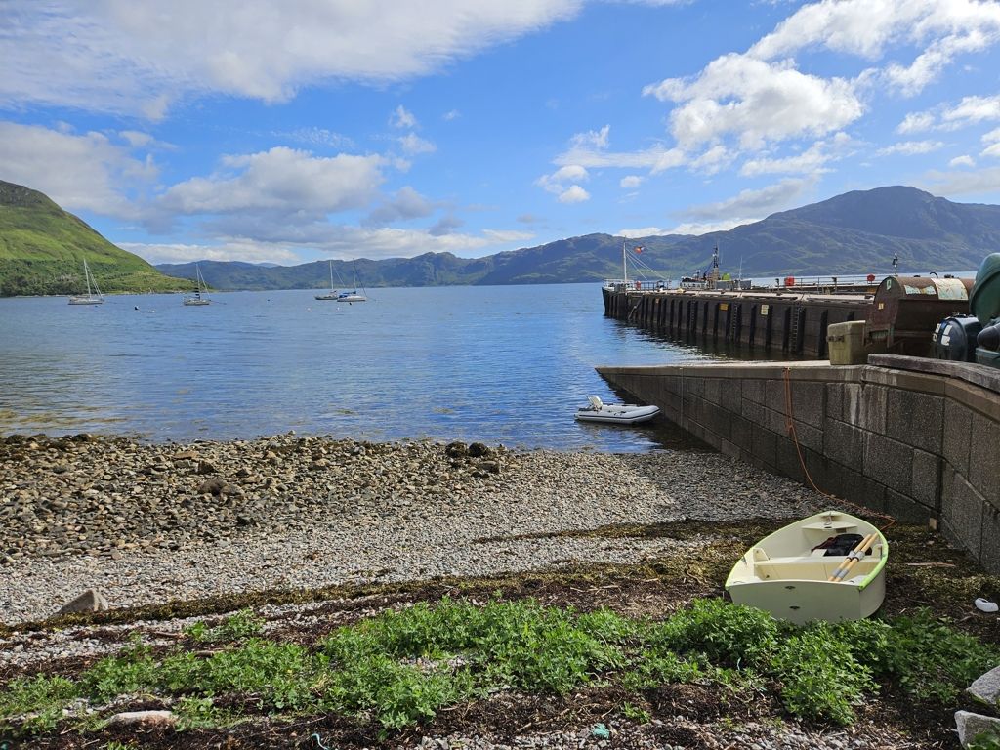

Our first expedition to the Isle of Rum got the whole crew drenched, so we spent the evening drying all of our gear and the boat. The morning greeted us with light winds and sunshine, and so before departure we decided to make use of the island's excellent shower facilities.

 

Once the dinghy was packed away again, we dropped the mooring ball and hoisted sail. A pleasant and fast beam reach back to mainland.

 

We sailed into the beautiful Loch Nevis and picked a mooring off the village of Inverie. This area is only reachable by boat or by hiking over the mountains. Accordingly, there is the "remotest pub In mainland UK" here. A lovely dinner and some chat with our boat neighbours followed. At least until midges chased us all back to our boats.

 

* Distance today: 19.4NM
* Total distance: 1778.8NM
* Lunch: feta salad
* Engine hours: 0.4
