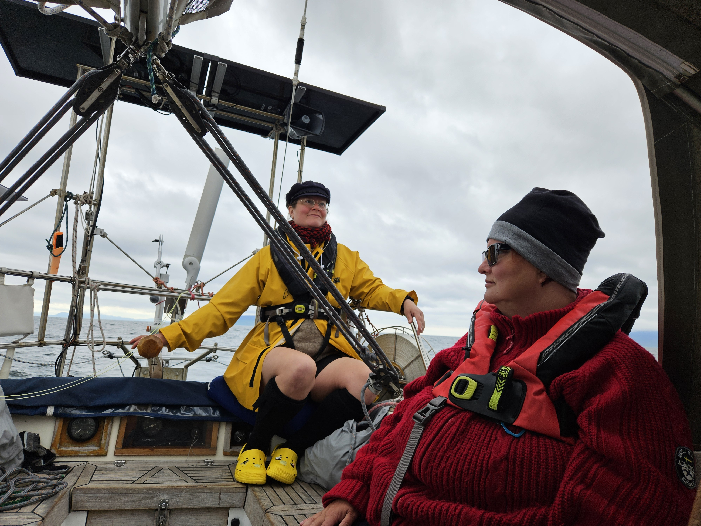

After a somewhat loud night with the mooring buoy banging against the hull in the windstill we set sail towards Skye. We sailed in the lee side of the loch, no waves but very variable winds, as can be expected. Winds ranging from 10 to 35 knots we made good progress towards our target.

 

Out of the loch we enjoyed steady winds on the beam until the Sleat Peninsula ate all of our wind and we needed to motor out of the localised windstill. After rounding the cape wind slowly came back and we could sail once more. First we rolled out just the genoa as we were going dead downwind. Then the wind increased enough for us to move to just to staysail. As we needed to then sail on a ever decreasing wind angle, we hoisted the main in second reef and went through the narrows of Loch Eishort with 6 knots of speed. Not much space for mistakes and we luckily didn't make one. After the narrows it was sails down and we motored to drop the anchor. 

Now we are tucked away in a protected bay waiting out the wind and rain.

* Distance today: 24.3NM
* Total distance: 1803.1NM
* Lunch: spinach chanterelle quiche
* Engine hours: 1.1
