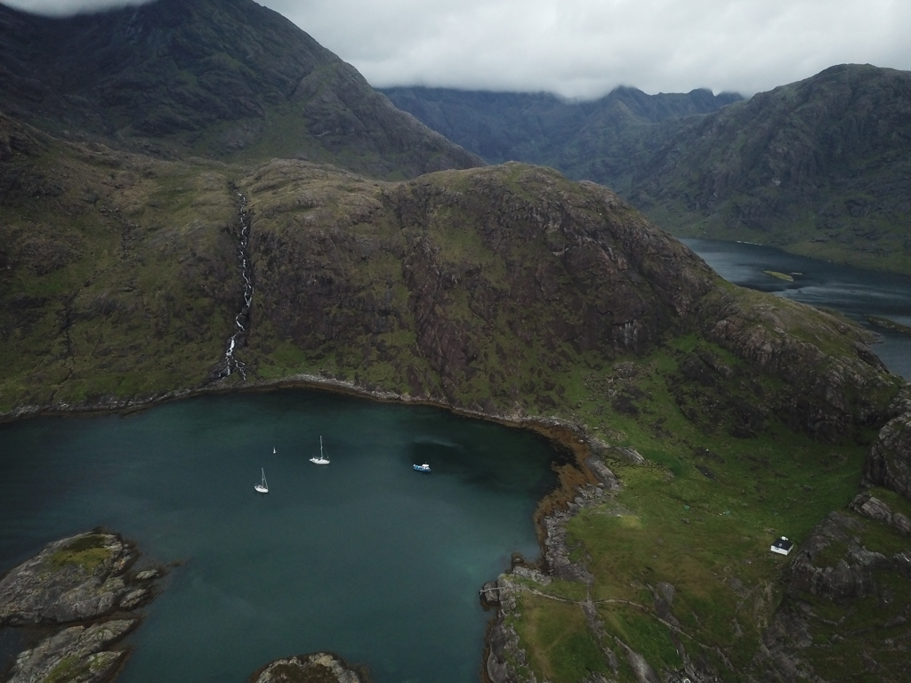
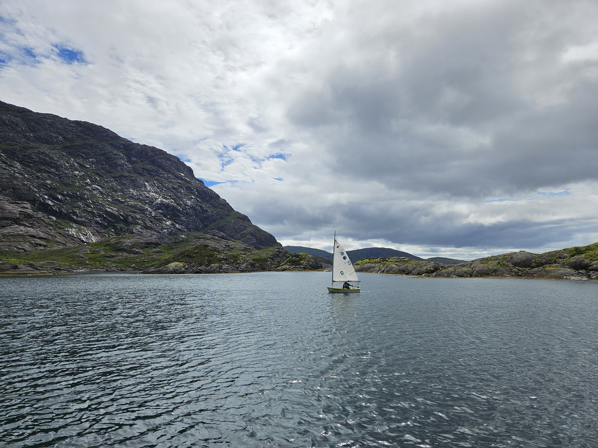

In the morning we got the northerly wind shift we had awaited. So, anchor up at 7:30, and in the light fickle winds we motored around the Strathaird Promontory to our target: the epic anchorage of Loch Scavaig.

A group of seals welcomed us in, and a Norwegian boat was just leaving the small anchorage. So we waited the single-hander to do his departure manouver, then dropped anchor to roughly where his had been. Now we're tucked away behind some drying rocks in a dramatically steep Loch.

 

Suski went to check out the shallower spots with the sailing dinghy, and next we'll go for a land adventure.

 

* Distance today: 12.7NM
* Total distance: 1815.8NM
* Lunch: pasta with cheese sauce
* Engine hours: 3.3
