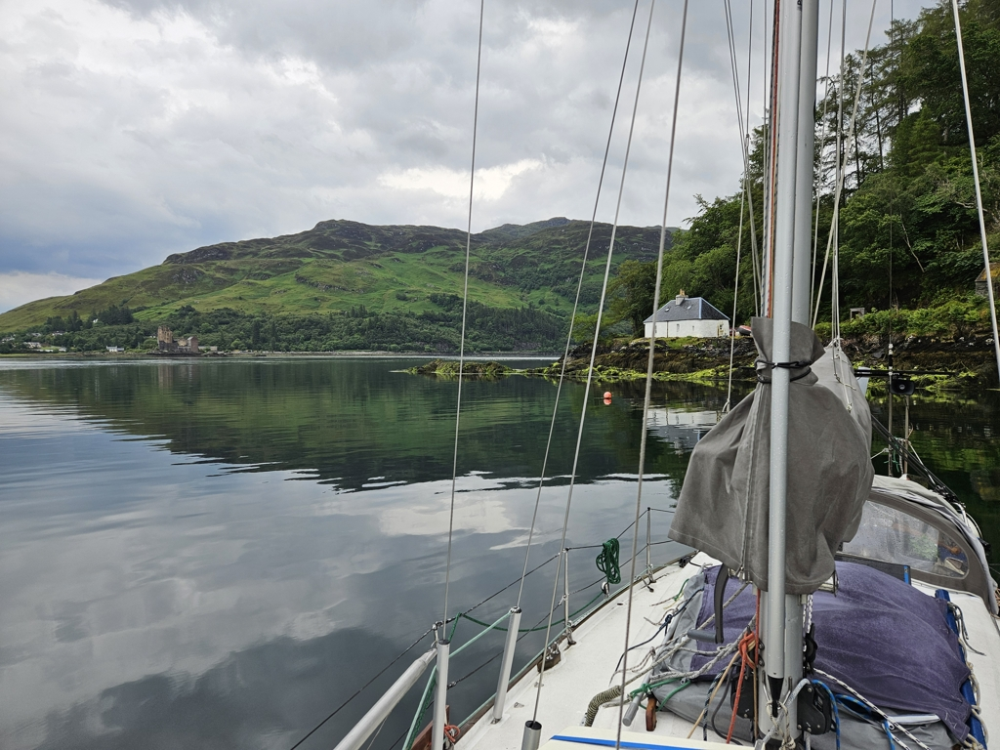

We left the beautiful anchorage at 8am after a quiet night. All of us slept well in the embrace of the mountains. We motored out into the glassy calm sea. A gale was coming, and we decided we'd rather have the Isle of Skye between us and it. After few hours of motoring and the promise of being way too early for our scheduled passing of Kyle Rhea, we rolled out the genoa and main sail. We were going nowhere fast, but that was exactly what we needed.

 

We kept monitoring the distance to Kyle Rhea and calculating the time when we latest need to turn on the motor again. After countless pointless manouvers and 3 hours of drifting, at times with 0kt of boat speed we were on our 3:30pm motor on time. After that we tuckered along and were nicely given way by the ferry going across Kyle Rhea. 

The rain started just before we were ready to drop anchor. We needed three tries to get the anchor down exactly how we wanted on the tight spot, as the best available space is taken by two moorings in use and two abandoned moorings.  Now we are awaiting the gale in perfect windstill and a nice view of the Eilean Donan castle.  Hopefully this will be our storm experience for the next two days also.

 

* Distance today: 36NM
* Total distance: 1851.8NM
* Lunch: lentil coconut curry
* Engine hours: 7.3
