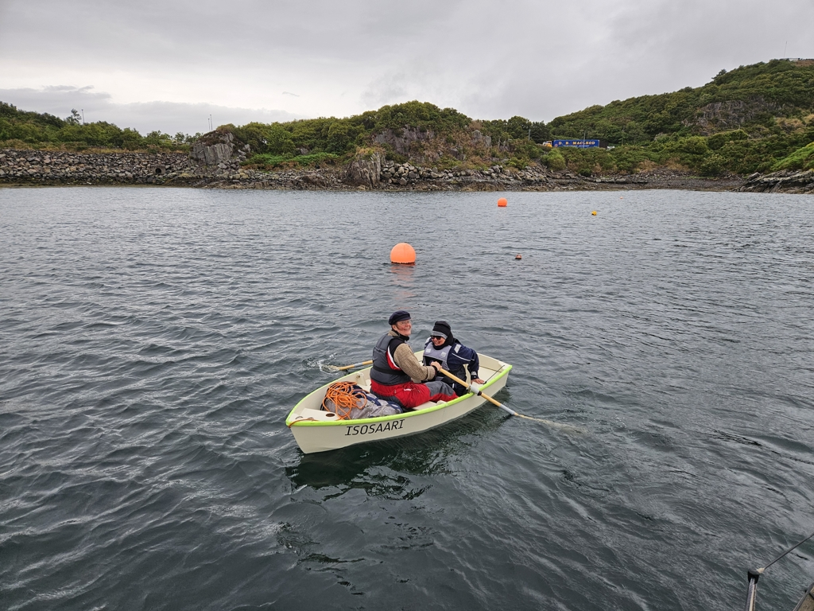

Weather chess is always difficult in new cruising grounds. But this time we hit the jackpot - the cosy little anchoring bay at Totaig had no swell, and cut the gale to nearly nothing. The only restless night was when the wind had a northerly component that blew occasionally into the bay. But even then, we were swinging securely on the anchor with good holding.

This morning it was time to move, as Karin had a train to catch. We hoisted anchor and motored past the dozen seals hanging out on the rock in the middle of the bay.

At this point, having missed basically all of the gale, it was still a bit of a question whether it had even been "that bad". The answer arrived as soon as we turned the corner into Loch Alsh. Even though the gale was already over, we had gusts up to 30kt, and nasty chop that got the helmsman soaked.

The conditions were such that the exposed marina in Kyle of Lochaish was closed, and the more protected one on the other side at Kyleakkn was packed to the gills. So we picked a visitor mooring by the Skye bridge and got Karin ashore via dinghy.

 

After the three storm days, we're pretty low on battery power, and it would be time for some provisions. But let's see how we handle those. Either we wait for the marina to open when the weather eases, or press on further. The forecast has almost no sunshine in it, so likely the power will need to come from the alternator.

* Distance today: 7.6NM
* Total distance: 1859.4NM
* Lunch: ramen
* Engine hours: 2.5
