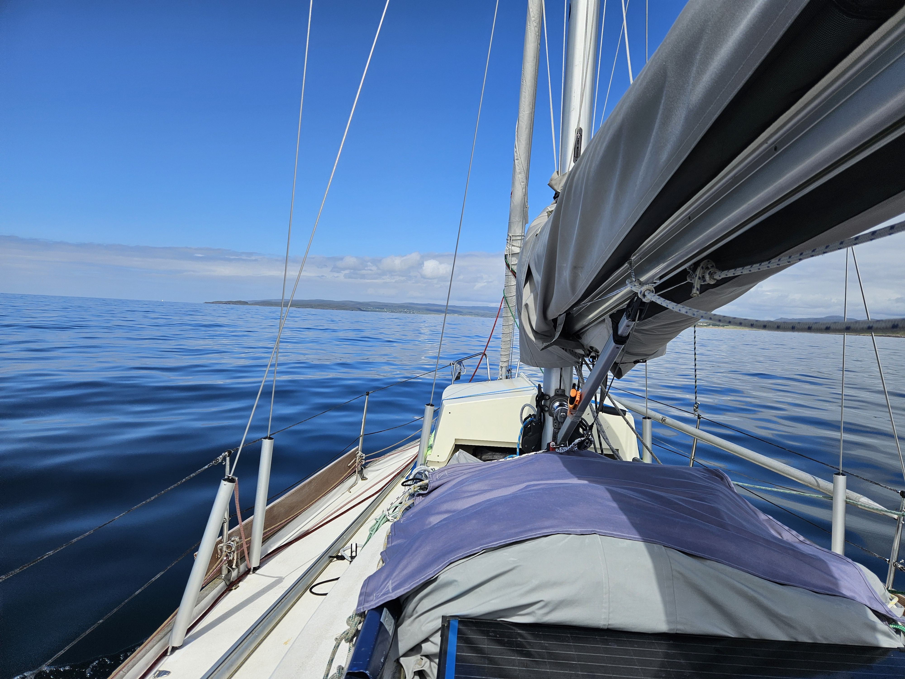
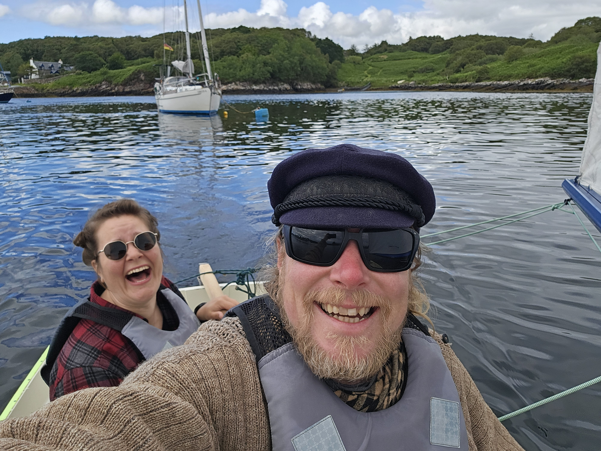

We woke up to the sound of rain. With the battery level of 35% this meant that it was time to go to a marina and charge the battery. We took off and motored the 1 NM to Kyle of Lochalsh and tied up to the floating pontoon. Only to realise that all the electrical outlet columns were wrapped tightly with black plastic bags and tape. So no power available. 

 

We then decided to just take out the trash and go grocery shopping and motor somewhere else to charge our batteries. So we picked one of the remote pubs as our destination.  The wind was light, so we got to motor in a gentle swell towards north. As the day progressed we rejoiced or every new 10% of charge. At some point we decided to take a shower under way not to stink when we would end up in the pub.

We took one of the visitor moorings and put Isosaari together and sailed to shore. Finally some sailing today!
There we ran into an Irish couple that we'd already met in Loch Scavaig. This time we could talk a little longer and ask for tips in places to visit around Ireland. 

 

Battery is now back to over 90% so we can continue cruising more normally. 

* Distance today: 30.8NM
* Total distance: 1890.2NM
* Lunch: grilled cheese sandwiches
* Engine hours: 7.9
