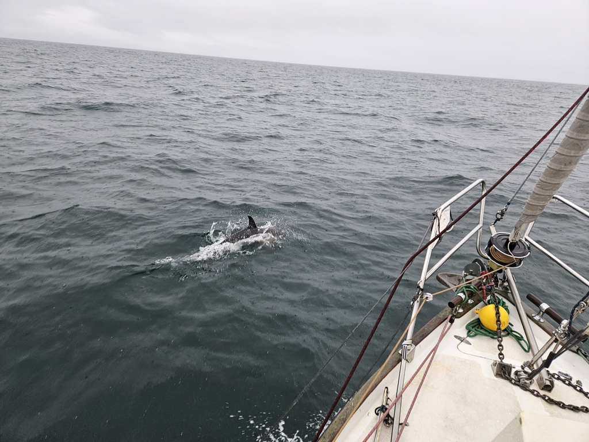
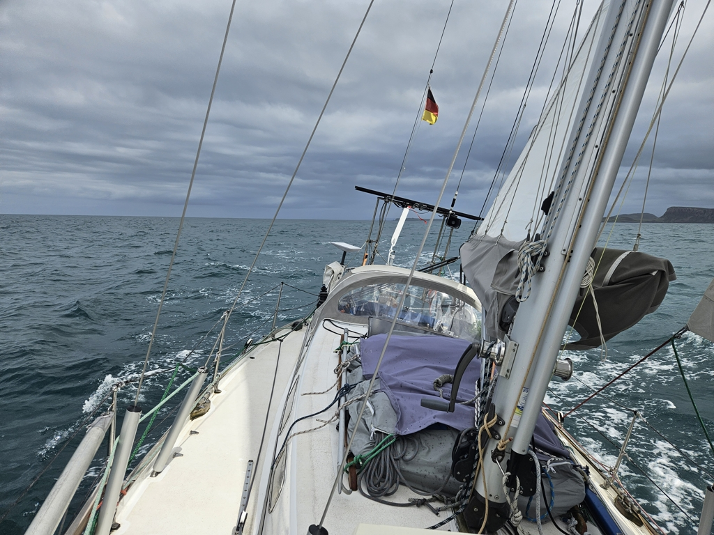

We dropped the mooring ball before 6am in order to catch the wind shift brought by a frontal passage. Then sails up and towards The Minch. Suski was feeling a bit under the weather, and so most of today was a solo affair.

We let the windvane steer as we headed west. This made catching the wind shift almost automatic, as the windvane would slowly pick more and more northerly course. The anticipated frontal passage came, bringing a lot of rain and the wind shift just as we were getting to the north corner of Skye. At this point two dolphins decided to delight us by playing for a half hour in our bow wave.

 

Once the wind had shifted to WNW, we did what had been planned as the only tack of the day. And then the wind died. This wasn't in the forecast!
We were left fighting the choppy conditions of The Minch, and a current against us in quite challenging sailing conditions. With the staysail we were underpowered to punch through the waves, but every time we rolled out the genoa, a big gust came, and so it was again time for staysail. Rinse and repeat.

As the ETA to our planned anchorage started slipping to after sunset, we did a rerouting to Loch Dunvegan. This allowed us to spend at least the last hours of today's sail on a swift broad reach, surfing down those same waves that had tormented us earlier.

 

Now we're anchored at the extremely pretty bay in the end of the Loch. 17 seals stared at us coming in, and the Dunvegan Castle sitting right next to where we dropped the hook.

* Distance today: 51.8NM
* Total distance: 1942NM
* Lunch: sandwiches
* Engine hours: 0.7
