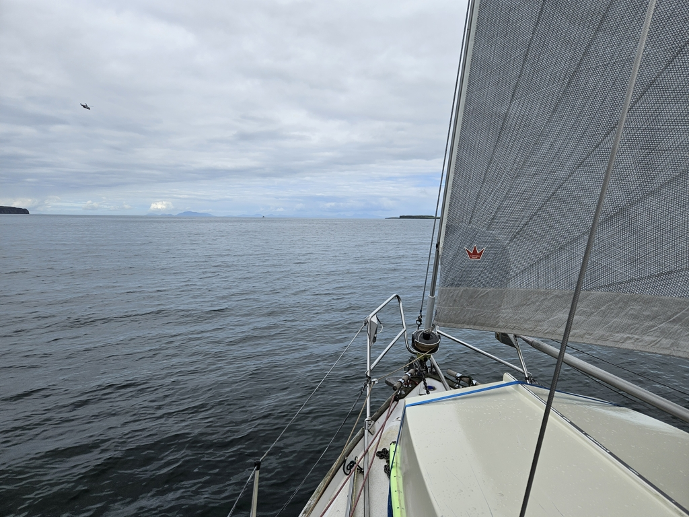
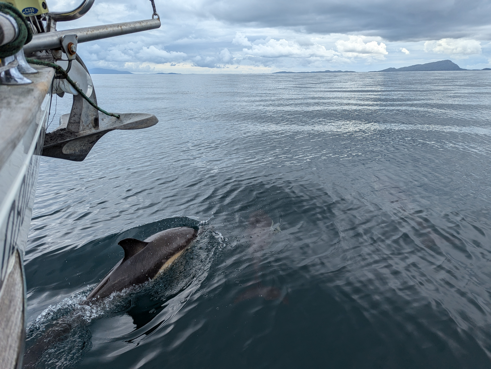
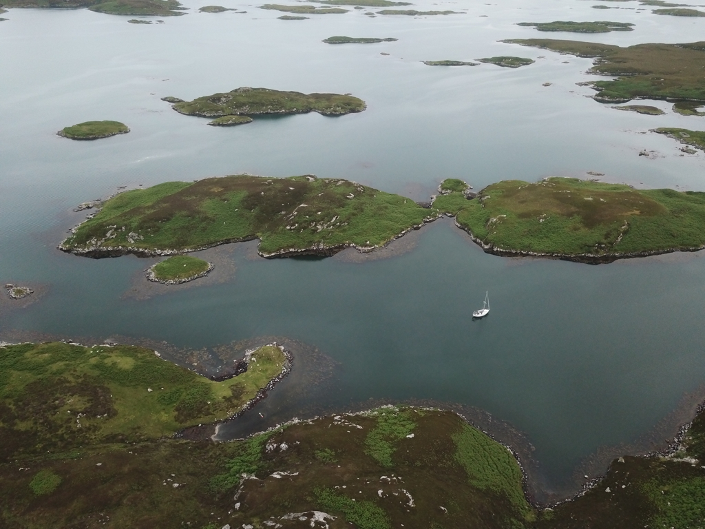

After this week's gale had passed we ventured back to the Little Minch, a bit unsure how the light winds and potential swell would work for us. But we encountered ripple calm seas, so as soon as we were past the last cape of Skye we hoisted the main sail and genoa. 

At first we had a joyful 10kn of wind roughly where we expected from. After that it became variable both in wind force and direction. As we let our windvane steer, our route became a meandering madness. We were going in all directions but the one we desired. So we just went into the general direction of Outer Hebrides. 

 

As we were joyfully going everywhere and nowhere we were greeted by a massive pod of dolphins. Even though we were slow, some of them stopped to play with our bow wave for nearly an hour. What a joy it is to follow the acrobatics of the dolphins swimming!

 

When we were three miles from Uist we finally gave up with the sailing and turned on the engine. Getting a bit of electricity to our batteries wouldn't go amiss. We took the direction of Haunaray Sound as it is a vast area with multiple different anchoring options. We entered through the narrow An t-Seolaid Mhor with a two knot current with us, so again entering a narrow spot with underwater obstructions with more speed that I would care to, but rising tide is a friend one must spend time with.

After the narrows we looked at different options and decided to check out the most complicated one, one we can only enter after mid tide. The twists and turns of the last narrow were done with utmost care and at no point we saw under two meters of water under the keel. Phew.

Now we are anchored in the middle of Eagle Pool and are surrounded by a gorgeous landscape. Definitely worth the stress of getting in. I'm happy to be the only boat in as there is no sufficient swing room for more boats.

 

* Distance today: 23.9NM
* Total distance: 1965.9NM
* Lunch: cheese and spinach börek
* Engine hours: 2.5
