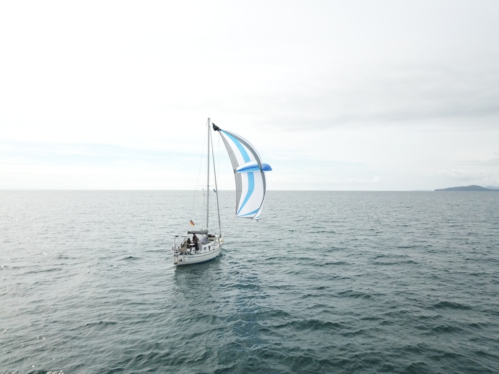

Morning dawned with a light northerly wind, and so we left the Haunaray Sound at high tide. Again no problems completing all the slalom turns of the narrow channel between the rocks. A few seals and red deer stopped to watch us pass.

Once at sea, we hoisted the Parasailor for what was planned to be a chill, smooth ride south the Outer Hebrides chain. Encouraged by the easy going, we decided that this would be our first time flying the drone while underway. Some nice footage was achieved, though the catcher received some bruises and gold paint from the propellers. Turns out the drone flies faster in reverse!

 

After we passed the southern tip of South Uist, the wind started dying. A big pod of dolphins swam around us, but they were too busy fishing to come and play. We kept going even though it was difficult to keep the Parasailor filled.

At Eriskay the wind filled in with a vengeance, going from 3kt to 20kt in just a couple of minutes. The resting off-watch was roused and we packed the Parasailor and hoisted the main.

Soon it was time to turn into the channel leading to Castlebay on the island of Barra. We were lucky with the ferry schedules, as the ship went in just before us. Would've been less fun in the narrow channel.

Now we're tied in the local marina with a view to the Kisimul castle. We'll stay here for a couple of days to reprovision and enjoy the island.

* Distance today: 41.3NM
