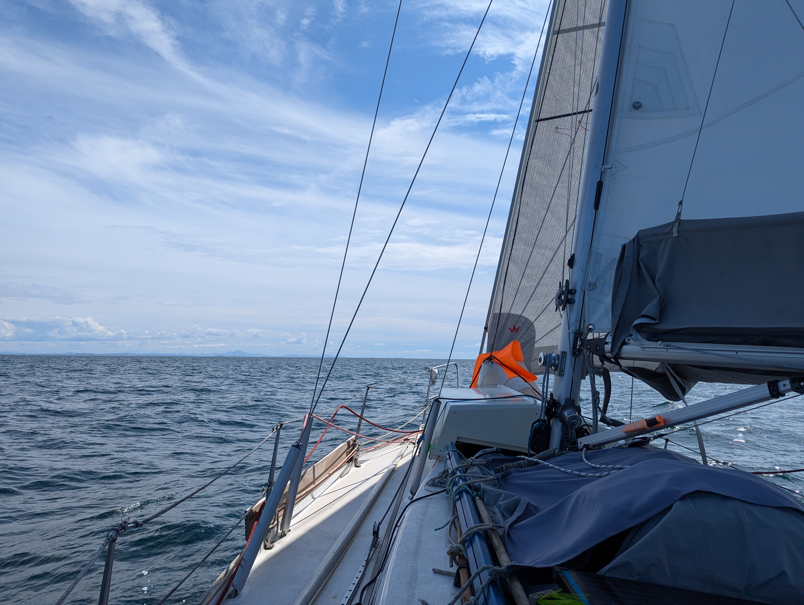
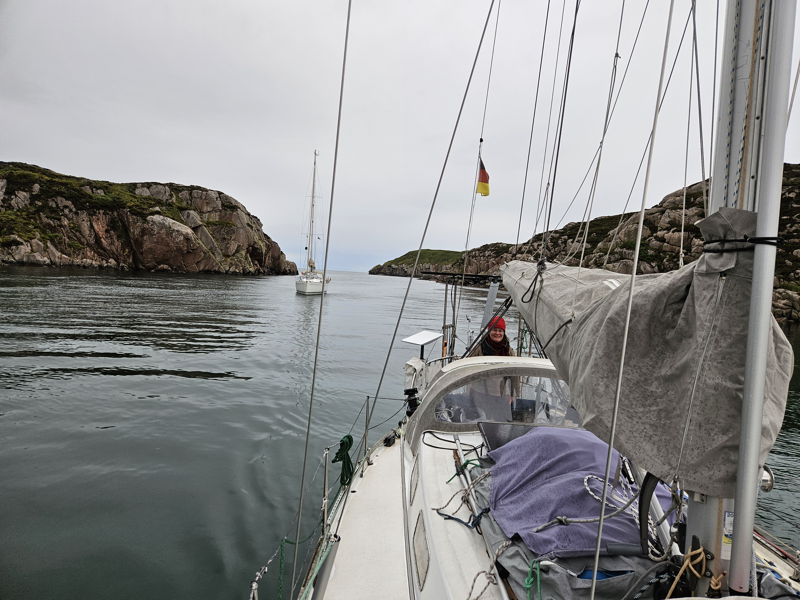
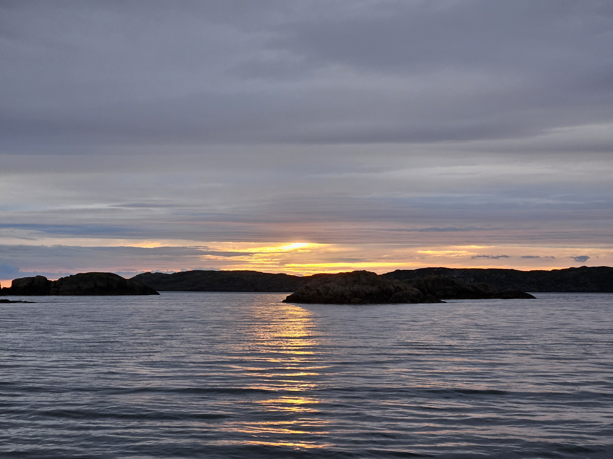

Sometimes getting out of harbour is a community event. Higher than expected winds right on the beam, with nothing but the finger on our lee and a neighboring boat hanging way beyond the stump of a finger meant that leaving would be difficult. As there was just 2 meters of pier left in front of us, we contemplated and tested leaving bow first. No chance,  the wind pushed us in so hard.
Then we drove to the bow spring and reversed out. All fine and dandy but the wave break was 2 boat lengths away and Lille Ø didn't want to turn in that space this time.  So after a bit of harbour tango later, it was time to abort the try, so we side tied on to the wave break. Phew.

It was time for a new plan. By this point we had already 2 persons helping us. We decided thst the best idea is to reverse along the pier (which of course contained a 130° angle) until we are in lee of another boat and then with ropes turn our bow pointing towards the exit.
With the helping hands this was achieved, so a couple of deep breaths later we thanked the helping hands and waved goodbye to the harbour, who were all watching by this point. The crew of the lovely French boat even gave us applause. So Suski raised her hand in victory and exited on stage left. Hopefully Lille Ø doesn't to star in 'hafenkino' again any time soon. At least we didn't hit anything, and don't have a scratch on the boat.

After motoring out to The Minch, we raised the main and staysail, based on the wind we'd had in the harbour. About 3 seconds later the wind dropped to 10 knots which meant that it was time to change from staysail to genoa. With that and wind on the beam we were eating miles. In the middle of The Minch we got the biggest surprise of the day. A big whale was splashing it's enormous tail multiple times. We were glad to see it in a bit of a distance as we were definitely way smaller than it was. 

 

After passing the Gunna Sound the sea state calmed a lot and we were gliding nearly silently further. As we came closer to Mull, wind decided to pick up again, so it was again time to switch back to staysail and back to genoa about 30 minutes later. 

 

In the SW corner of Mull there is a plethora of anchorages, so after a bit of shopping around we came to Tinker's Hole. The main channel was full of boats, but we chose rather the other side of Eilean Dubh to have no view of other boats and a chance to see the sunset, if it stops raining before that.

 

* Distance today: 57.8NM
* Total distance: 2065NM
* Lunch: Couscous salad
* Engine hours: 1.9
