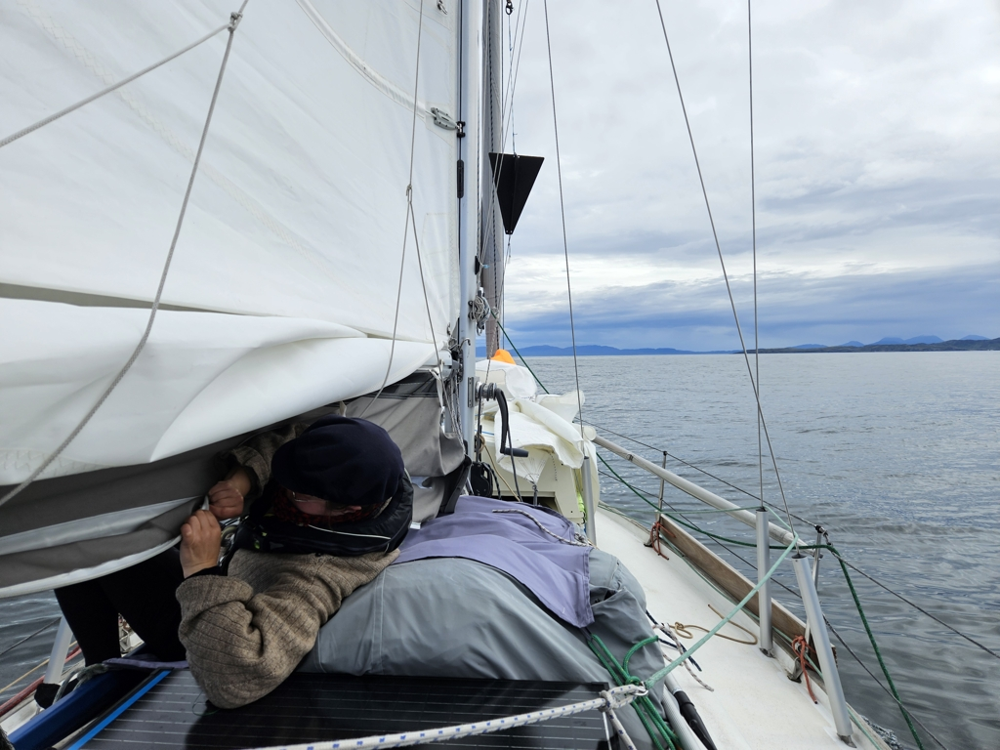

Having enjoyed an epic sunset with a double rainbow and a restful night, we hoisted the anchor in the morning. Forecast was showing a nice but rainy 10-15kt downwind run to Jura.

Well, that wasn't the reality. As soon as we got to the Firth of Lorne, the wind died and the sun came out. Expecting this to be a short lull, we drifted for about two hours while doing some boat maintenance. There were practically no other boats out anyway.

 

A swell kept building up, and the wind didn't materialise,  and so we resigned ourselves to motoring. First with the mainsail and motorsailing cone up, but then as the swell kept banging the sail, we also took those down. At least the sunshine was nice. One of the first sailing days this summer when you didn't need a sweater!

Entering Loch Tarbert, the wind finally did come up. And plenty of it. We went from about 3kt to 28kt in maybe the distance of half a nautical mile. This made navigating the twisty-turny channel into the inner loch a bit interesting, but luckily this one is well marked with transits on the shore.

As we passed the narrowest spot, we were buzzed by a military transport plane flying low along the loch. The geological sights of the raised beaches were also interesting. 

 

Now we're anchored at Bothy Bay. The inner Loch Tarbert is quite shallow, and so while there is no protection from the wind, we have plenty of room to swing on the anchor. Hopefully the stronger winds pass sooner than forecasted so that we can explore a bit with the dinghy!

* Distance today: 28.5NM
* Total distance: 2093.5NM
* Lunch: Avocado toast
* Engine hours: 4.8
