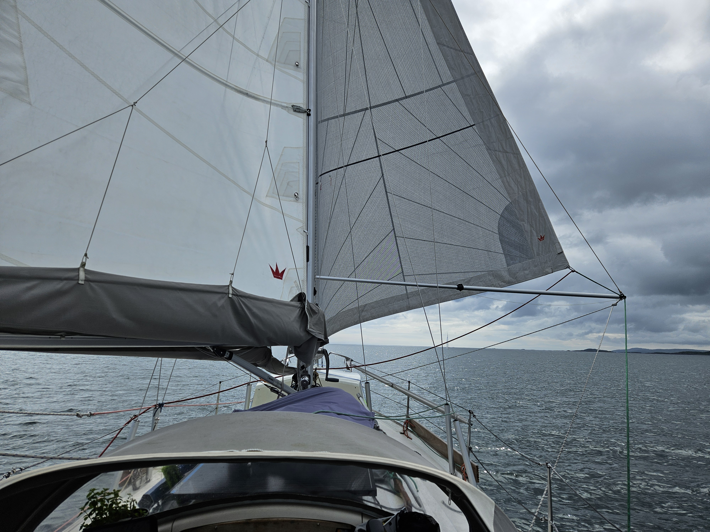
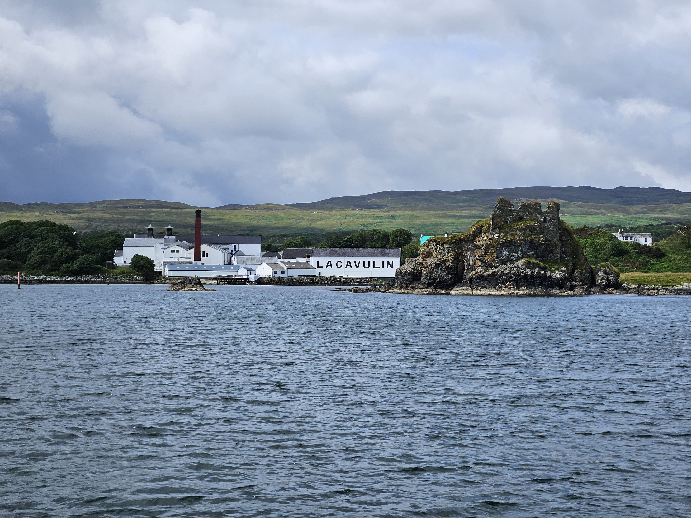

We hoisted the anchor a bit after nine and left the beautiful and rocky terrain of Jura behind. We motored through the narrows and hoisted the main sail and genoa close reached. In the beginning we had some proper wind and could fight the current pushing us to shore, but it got weaker and weaker. We tacked to give us more sea room, but that was not enough, we were being pushed ashore as the wind died down completely. 

So we motorsailed towards Sound of Islay. When we had Bunnahabhain in our sights, the wind started again and we could start sailing again in the ever increasing tidal stream. After Caol Ila we passed the ferry wing on wing doing 7.6 knots aided by the 3 knot current!

 

As the day progressed we kept changing the tack and whether or not we were wing on wing of on beam reach. After rounding the last corner, we set our sights to our destination Lagavulin Bay with it's narrow entrance and shallow pool. To our great surprise no one else was in there, so we didn't even need to think of our secondary option, Ardbeg. In Lagavulin Bay we could pick our anchoring spot freely between the moorings and are now anchored in 2.3 meters on low tide. We haven't seen this little scope since Berlin, especially given the 40cm tidal range!

 

Now it is time to explore some whisky we have sailed past. We'll start with a Jura, thanks to Bernhard!

* Distance today: 29.9NM
* Total distance: 2123.4NM
* Lunch: spaghetti with avocado sauce 
* Engine hours: 1.7
