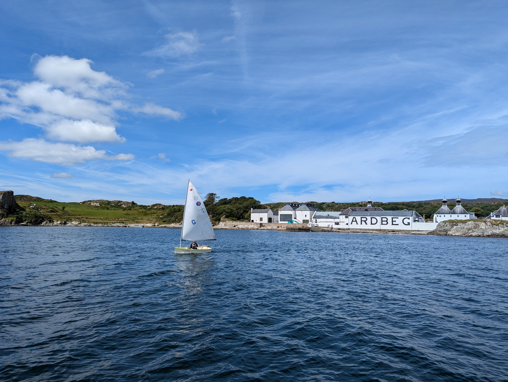

Yesterday was spent on land adventures - visiting  two of the distilleries, and dinner in the town of Port Ellen. As we have a distillery tour booked at Ardbeg for tomorrow, we decided to move closer today.

As this area is full of reefs, we waited for the rising tide before hoisting anchor. This coincided with the morning fog lifting, and so we had a nice easy motoring over to the next anchorage. We tested how it is to tow Isosaari, and that also went without a hitch.

 

Now we're swinging on one of the distillery's branded mooring balls. As the weather is still nice and light, this means an opportunity to do some boat projects and to take Isosaari our for a spin. Turns out seals are less afraid of the dinghy sailing than rowing.

* Distance today: 0.8NM
* Total distance: 2124.2NM
* Lunch: fried rice with mushrooms
* Engine hours: 0.4
