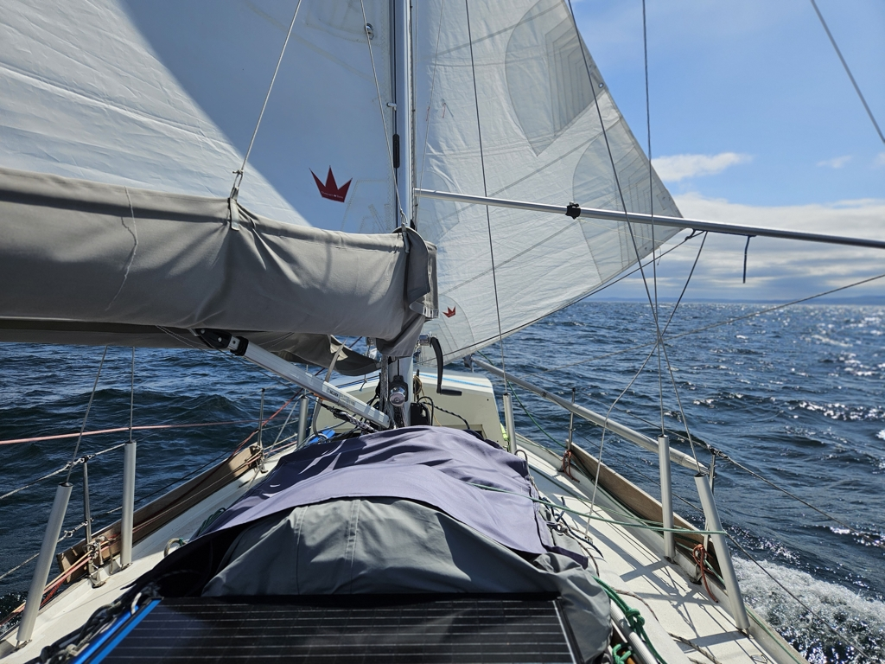
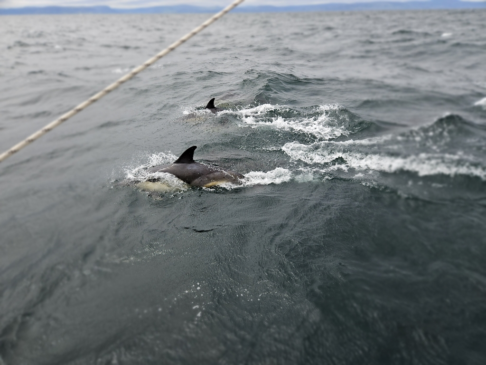
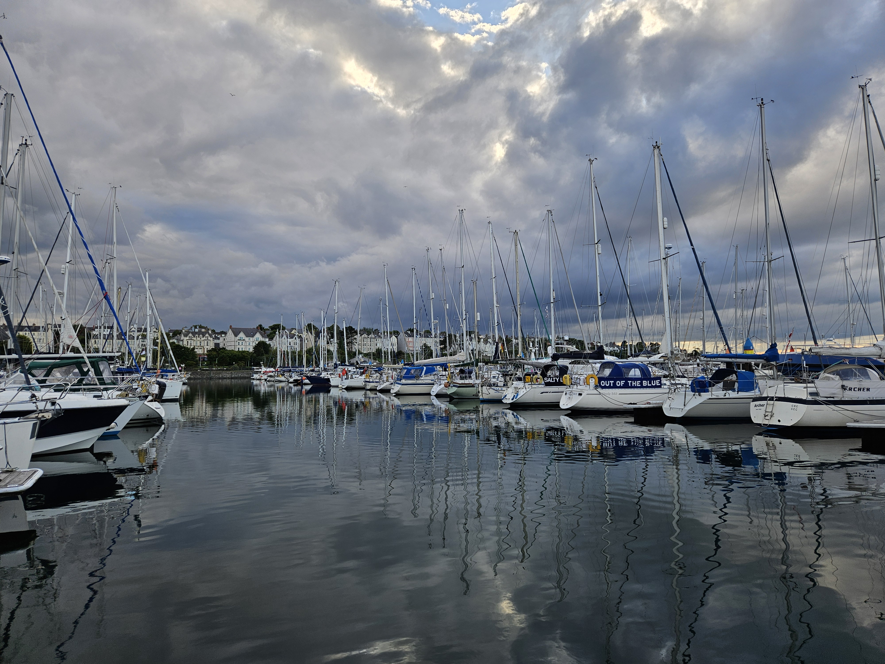

Today was a race against the dying wind. We woke up at 5am, drank some coffee and were on our way. The little wind from the morning was expected to fill in before dying, hopefully after we arrive.

The wind started in an on/off mode. It was either 2 knots or 20 knots from a completely different direction, so the brain that had just woken up had to really concentrate.

As promised by the weather forecast the wind filled and we were flying along wing on wing, untill the tide turned. Then we were punching through choppy seas tick tocking from side to side with a measely 2.5 knots of velocity made good.

 

The tides in the north channel don't run an even 6 and 6 rhythm, but the south going tide lasts longer, so the fight with the current was short lived. At Mull of Kintyre we were past the traffic separation scheme and could again assume our position as the stand on vessel! To celebrate, a pod of dolphins came to play for a while in our bow wave.

 

The luscious green hills of Northern Ireland greeted us under sunshine and we were making good progress. Our luck with the wind didn't though last right to the end of the day, and we needed to motor the last 7 NM. At least we had a nice windstill to drive in the massive marina of Bangor, 560 boats! We found our assigned berth thanks to good instructions by the marina staff. 

 

Now we need to do a bit of housekeeping on Lille Ø as the last trash can and laundry machine were seen in the Outer Hebrides.

* Distance today: 61.6NM
* Total distance: 2185.8NM
* Lunch: feta salad
* Engine hours: 2.3
