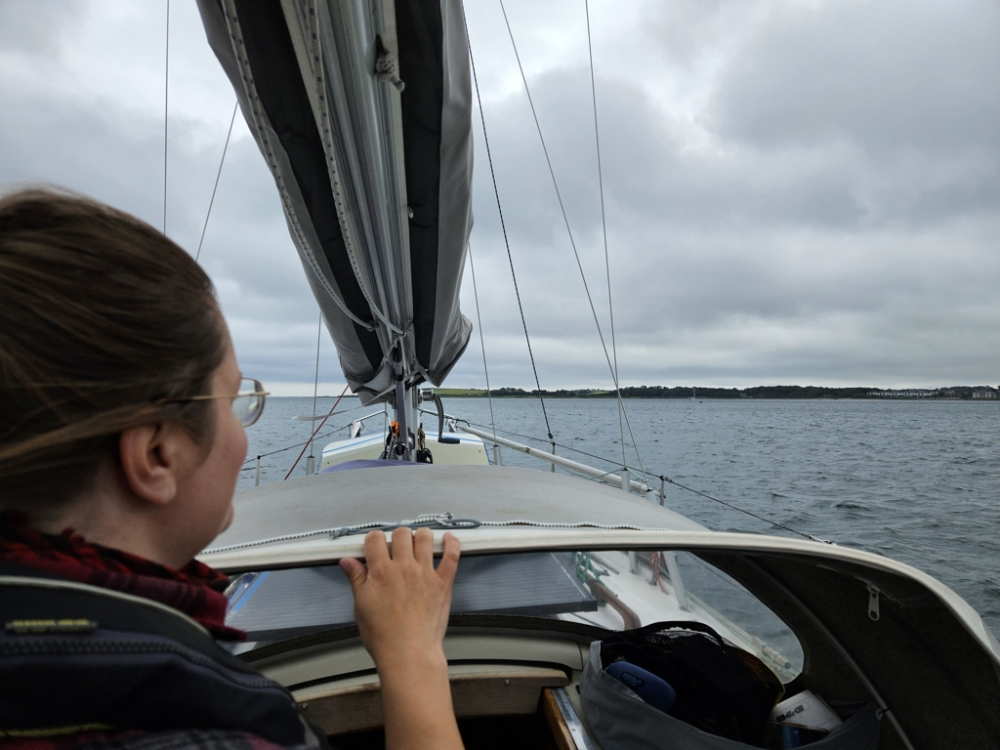

After a couple of days exploring the museums and gardens of the area, there is finally favourable wind in the forecast. To capitalise on that - and to save on marina fees - we decided to move to the nearby anchorage. It will be easier to leave from here when the time is right.

 

Harbour departure was a bit tricky with both prop walk and wind trying to prevent the turn we had to make. We managed it, just, with some rope work and decisive application of throttle.
Then out of the marina, and into the nice beachy bay that will be our home for tonight.

There is one Dutch sailboat sharing the anchorage, and the dinghies of the local sailing club keep zipping by.

* Distance today: 1.7NM
* Total distance: 2187.5NM
* Lunch: salad
* Engine hours: 0.7
