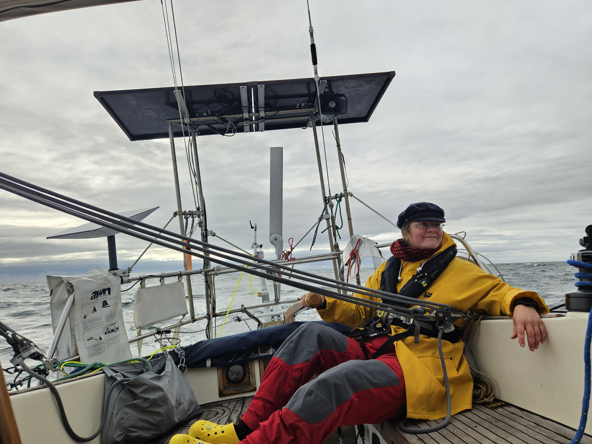
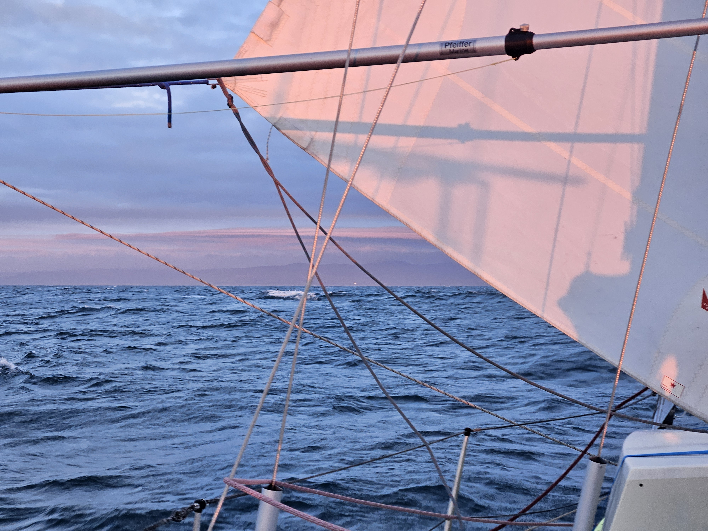
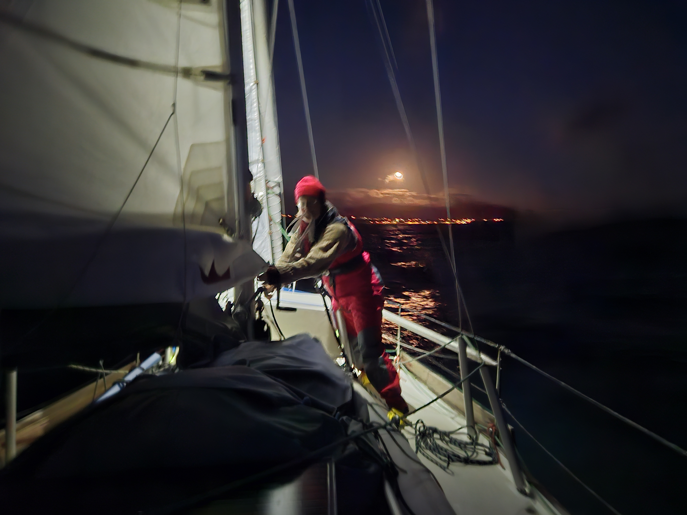

As the westerlies and northerlies have been few and far between, we took the option of leaving in the evening and arriving in the morning at Isle of Man, and waiting for the +-2h of the high water to enter the harbour. At least that was the plan.

We turned the engine on at 16 and motorsailed in calm conditions through the Donaghagee Sound. While in the Sound we had 2 knot current with us so we were making very good speed. As we were past the last fairway markers and the standing waves were behind us, we rolled out the genoa in a gentle 8 knot wind. 

After a bit of genoa sailing the wind started to pick up as expected and we changed over to stay sail when it was still measely 11 kn. After the sail change was done, wind rapidly went from 15 to 20 to 25 knots and we were absolutely flying along with a 2 knot current.

As the wind picked up earlier than expected we also got the higher winds in the North Channel, so after a 4 hour sail we were already 1 hour ahead of our schedule. Which meant that we were constantly getting better winds as we expected. 

 

The sailing was good. Suski was hand steering with the biggest grin on her face. The wind kept being variable and waves big, so steering the surfs down the waves required concentration and a bit of muscle power.

 

As the sun set, we realised we were definitely going to make it in already during the night. With the northerly wind and swell. Not optimal, but we decided to go in anyway. As the seafloor kept getting closer to the surface, the waves kept growing bigger, and more confused. 

Exactly what we wanted to avoid in the first place by arriving around sunrise, but here we were, four hours ahead of schedule. We motorsailed through the swell and made it inside the breakwater. There we contacted harbour office on VHF to book a bridge opening and dropped the sail.

 

After the bridge lights turned green, we carefully motored in through the somewhat turbulent waters. Fishing boats lining the walls made the narrow fairway even narrower and in the darkness estimating distances is so much harder. We found the assigned C pier, but couldn't see a single number telling what spot it is, so we went in to a slot with no other boats, as by this point the stress of getting in was taking its toll and simple things were becoming hard. We tied the boat into the pier, and confirmed with harbour office that we can use this box. Were happy, we were in, sometimes it's not the how, but the end result.

* Distance today: 46.9NM
* Total distance: 2234.4NM
* Lunch: spaghetti bolognese 
* Engine hours: 1.7
