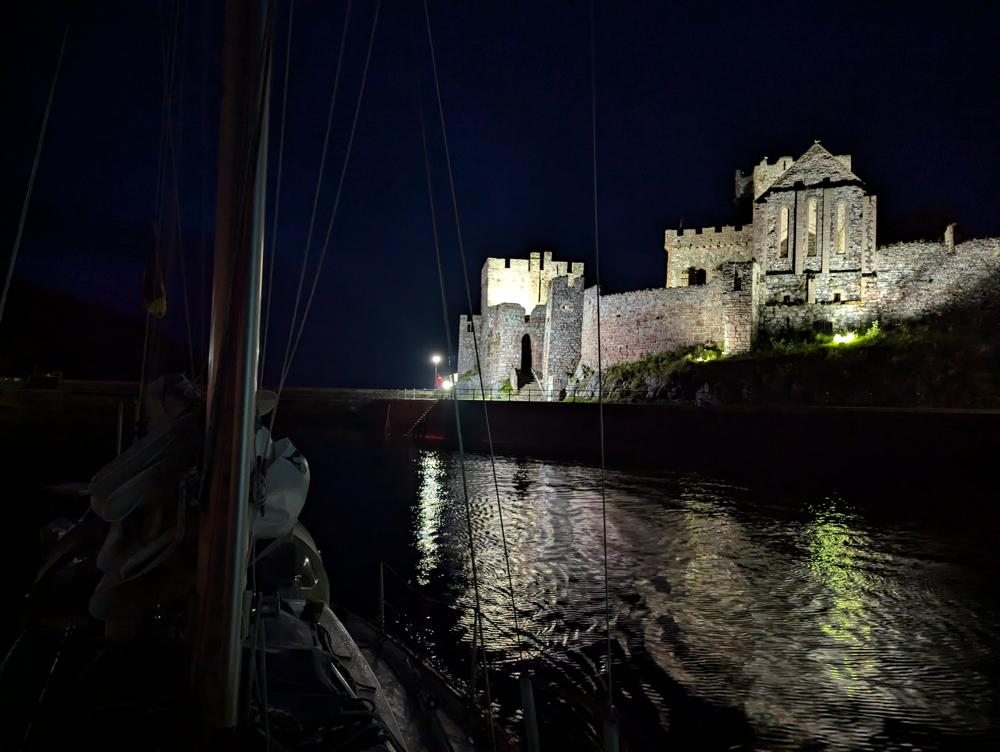
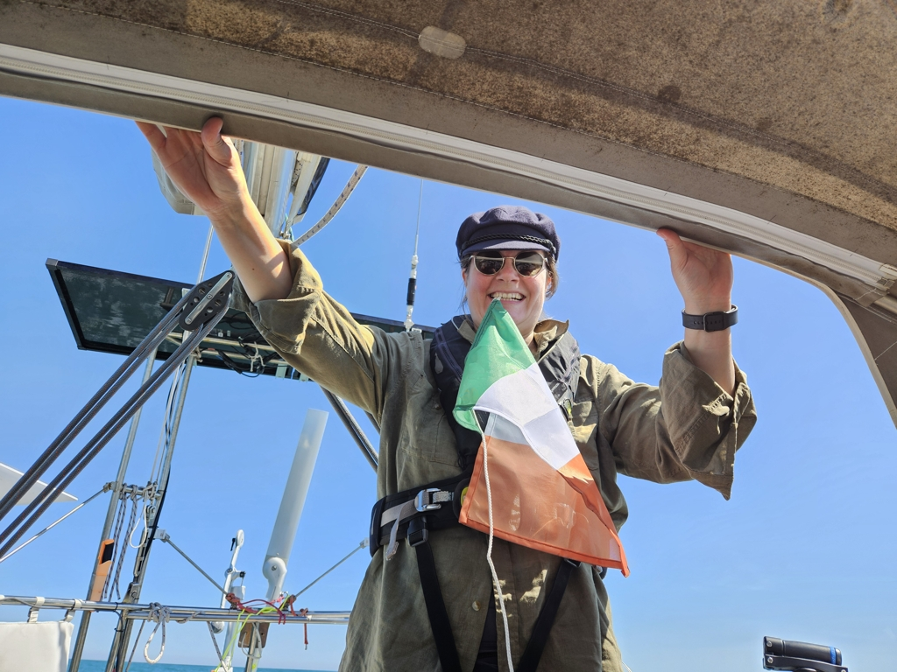

After two fun days on Isle of Man, there was again a forecast that got us moving - the winds would turn northerly in the evening, and remain so for about 12h. Luckily that coincided with the evening high water, and so we grabbed passage pizza and left Peel marina at 11pm towards the darkening Irish Sea.

 

The first couple of hours went under engine, until the wind filled in. We poled out for a wing-on-wing configuration with the genoa. Around sunrise the wind picked up even more, and we moved to a broad reach with the staysail.

There was quite a bit of fishing traffic near the coast of Man, but afterwards we had the sea mostly for ourselves. The summer is more and more here as we head south, and this was the first time on this trip when night watches weren't cold.

 

In the early afternoon the wind died again, and we motored into the Howth Yacht Club harbour just outside Dublin. The harbour is busy with all kinds of boats coming in and out, so seems the summer vacation season is in full swing here.

* Distance today: 73.3NM
* Total distance: 2307.7NM
* Snack: pizza
* Engine hours: 5.2
