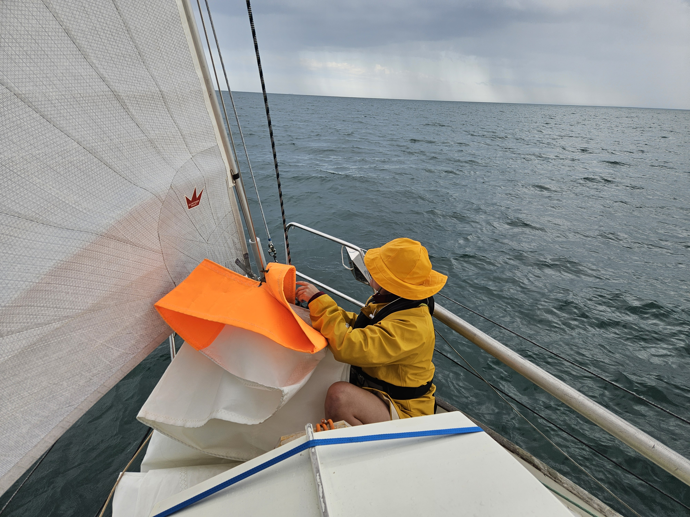
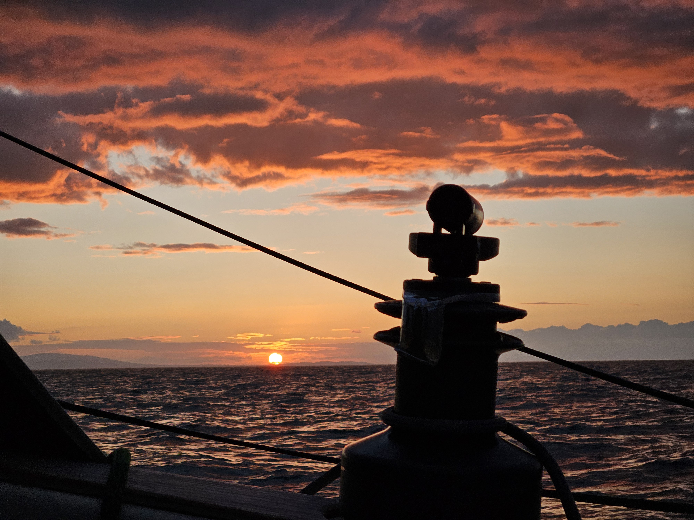

After fixing the shredded wire from our starboard nav light, we were ready to leave. We expected wind to go from S to SW to W before turning back to S in the morning. So we ventured in to the evening. For our dinner entertainment, a pod of dolphins came to say hello and played in the bow wave for a bit before continuing on their way. We were pinching towards south in a comfortable current with us.

 

As the current turned against us, started the game of sail changes. We needed to have absolutely perfect sail balance at all times as the current was at times over 3 knots against us. Getting the last drop of speed over water was crucial not to start sailing backwards. 

 

As the current turned once again favorable for us the wind did the same, but beating in to the wind with favorable current is sweet. As sun was rising we had reached our destination and could tie to the visitor pontoon as the first beams of sunlight hit our deck. 

* Distance today: 52.6NM
* Total distance: 2360.3NM
* Dinner: spaghetti with tomato sauce
* Engine hours: 1.1
