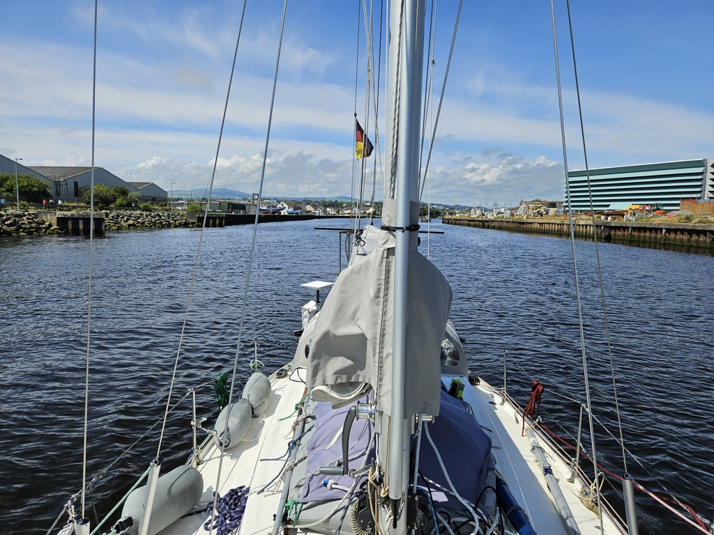

After some resupplying and a fun party at the local sailing club, we decided to move the boat to a nearby anchorage. Roadstone Bay is an old quarry dock that had been recommended to us.

 

Now we will wait for the forecasted wind shift around Tuesday that should carry us further south. Summer is finally here, and the beach on the shore was totally packed when we arrived.

* Distance today: 1.5NM
* Total distance: 2309.2NM
* Lunch: croissants with cheese and olive filling
* Engine hours: 0.8
