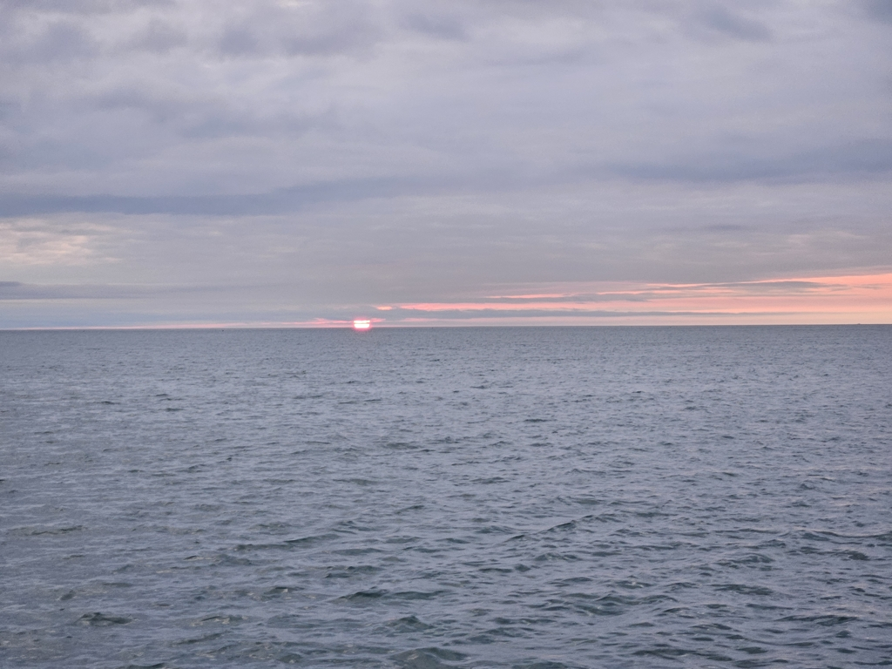

In tidal areas there is almost always a schedule to follow, even when doing a multi-day passage. Stream charts showed that the current would be much stronger in St. George's Channel than on the wider Celtic Sea, and so this meant an early morning start. 

 

We initially motored, and then sailed in the light winds towards the sea. During the first six hours of the trip, this was greatly aided by the two knot current. We passed an east cardinal buoy off Moneyweights Bank, marking a milestone: Lille Ø was now further south than it has ever been, as we crossed the latitude of Meierei in Potsdam.

Our timings worked out, and the tide turned just when we exited the channel. This means we still had current against us, but only half of what it would've been more to the north.

 

The sea has been mostly empty, though we had to radio a cargo ship to clarify that they had actually seen us and were going to evade. Now we're making dinner before turning into night watches. Appropriately, a few dolphins came to keep us company for a while. 

* Distance today: 61.4NM
* Total distance: 2423.2NM
* Engine hours: 0.8
* Dinner: spaghetti with avocado sauce
