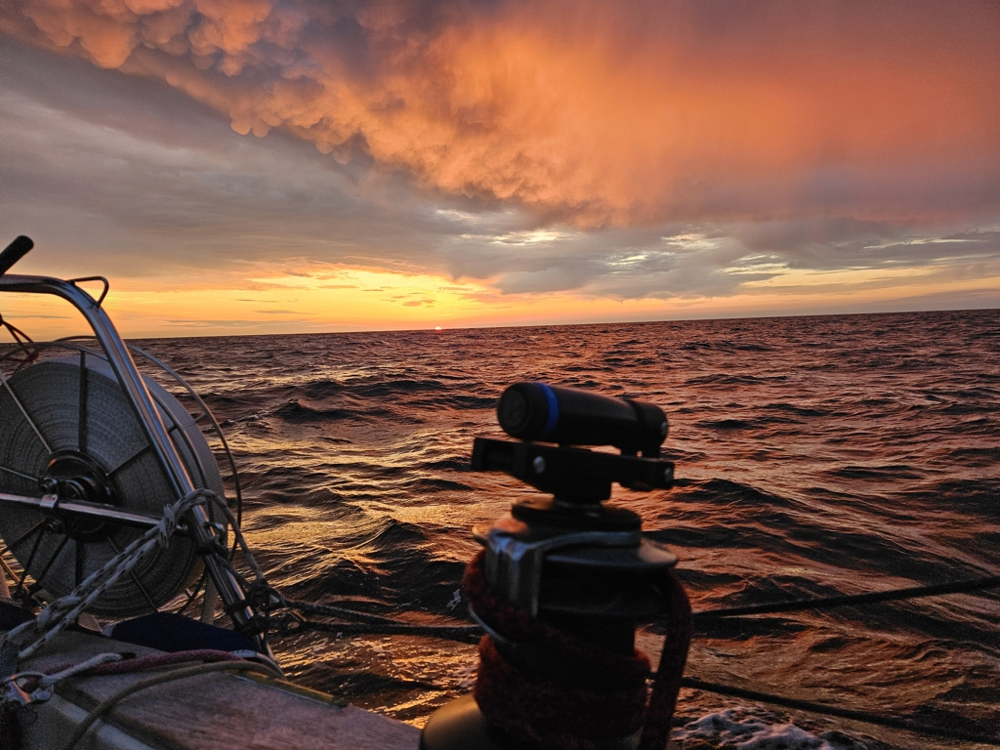

The night was littered with lights. Cargo ships, fishing boats and even couple sailboats. As the moon was only a sliver, we could see the milky way across the sky. Even some shooting stars kept us entertained.

 

As the dawn broke, we were past the biggest congestion of boats and had the sea more or less to ourselves. With the ever decreasing wind we tried out different configurations to keep the banging of the sails at minimum. As the wind decreased to a mere 6kn, it was time to accept defeat, and we dropped the sails and motored the rest of the way.

The summer is finally here and after dropping the hook we both went for a refreshing swim! Now we shall move to island time and use the high tides to explore the Isles of Scilly. 

 

* Distance today: 110.6NM
* Total distance: 2533.8NM
* Lunch: shaksuka 
* Engine hours: 4.9
