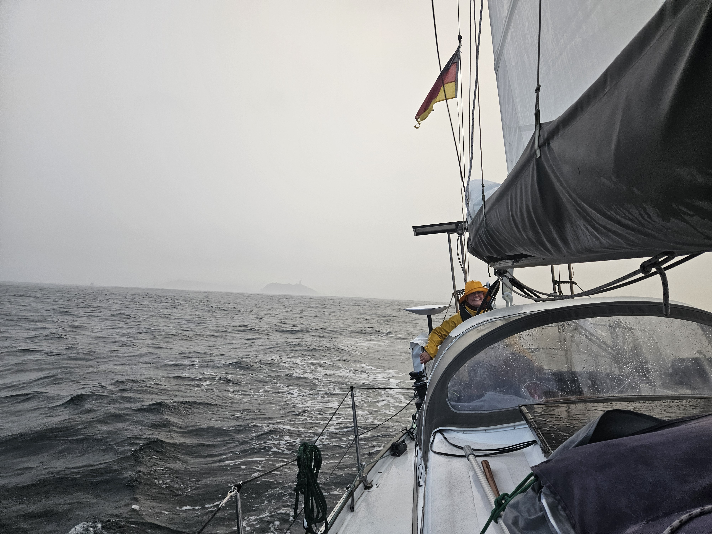
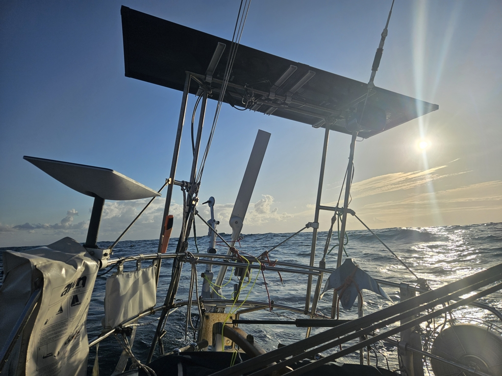

When to leave is always the big dilemma when planning for a bigger ocean passage. I feel a nervous lump in my stomach every time. But when the engine is on and the anchor is up the lump disappears and instead I'm confident and happy. The decision has been made and what ever comes, Lille Ø can handle it.

This time our decision was to leave on Tuesday morning or if the windshift comes during daylight hours, the on Monday evening. With the rain came the expected windshift and we made the boat ready and left an hour before sunset. The large ocean swell greeted us when we emerged from behind the lighthouse island. We hoisted the main in 1st reef and started rounding the Isles of Scilly from the lee side.

 

In the pouring rain we cleared ourselves from the traffic separation scheme and took our course towards Spain. The night was pitch black. Occasionally you could see the stars and the milky way, but moon never showed itself. After what felt an eternal night, the dawn broke through and we finally could see what kind of swell are we dealing with.

The ride has been somewhat lumpy in the moderate sea state but we have both been sleeping well on our off watches. As we are settling to our second night with dinner in our bellies I can only feel joy that we can be on this journey together.

 

* Distance today: 108NM
* Total distance: 2641.8NM
* Dinner: chanterelle risotto 
* Engine hours: 1.8
