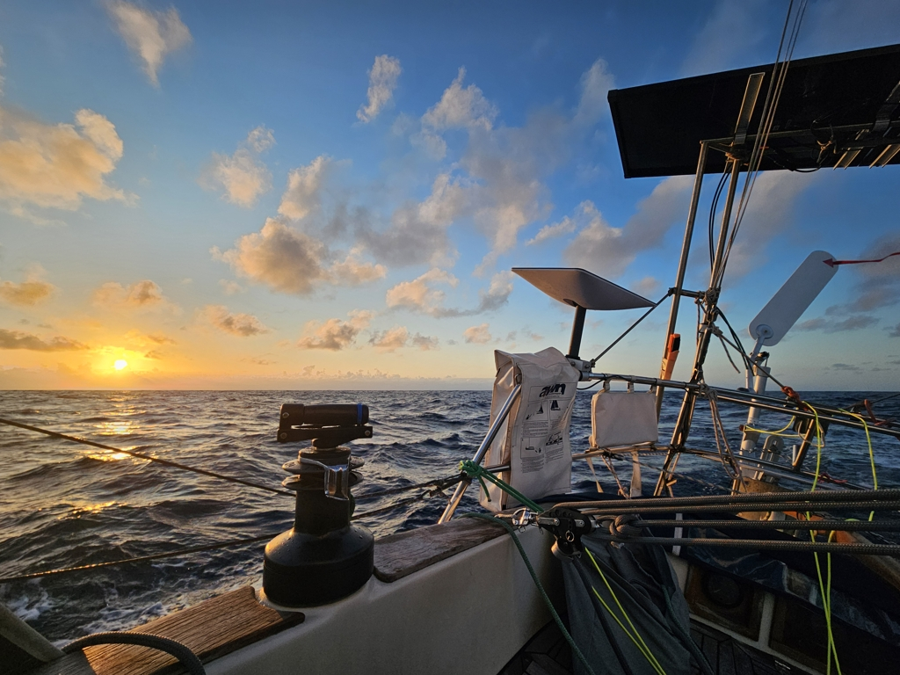
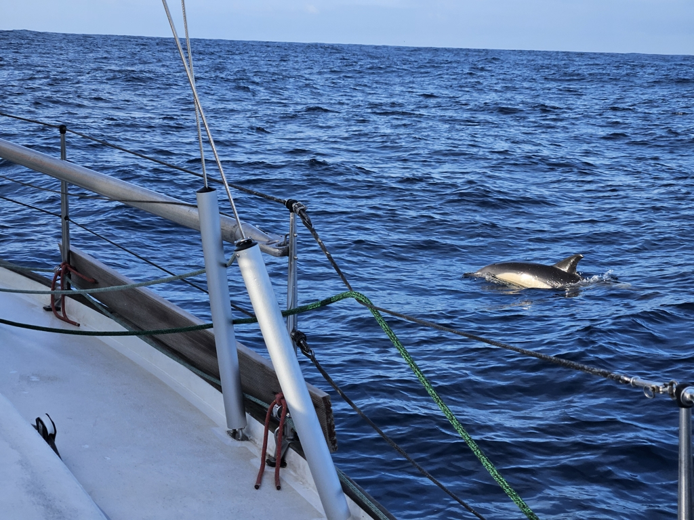

In the evening we were hit by one squall gusting 30kt, though only for some seconds. When the next one was approaching, we prepared by reefing. This time it was a dud, but we still sailed into the darkening night with a reefed main and the staysail.

 

With it being new moon, the night was really dark, with stars mostly obscured by the humid air. Overnight the wind became lighter, and we could again carry full sail.

Morning brightened with a very nice setting: the sea was quite calm and there were only some puffy clouds between us and the sun. Warm and light conditions continued throughout the day.

 

At the edge of the continental shelf we had to do some manouvers to avoid the big fishing fleet, but otherwise the day has been uneventful, allowing the on-watch to catch up with some reading and crafts projects. Now we're in proper ocean conditions, with some 4000m of water below the keel. Accordingly, the sea state has become even mellower, with only the long mild 2-3m Atlantic swell keeping us company. Boat goes up the hill, boat goes down the hill...

We're now around the halfway mark for this passage. Forecast has us reaching the persistent high pressure ridge sitting north of the Spanish coast sometime overnight. That will likely require some motoring to punch through, as there will be absolutely no wind for weeks in that area.

* Distance today: 101NM
* Total distance: 2742.8NM
* Dinner: feta salad
* Engine hours: 0
