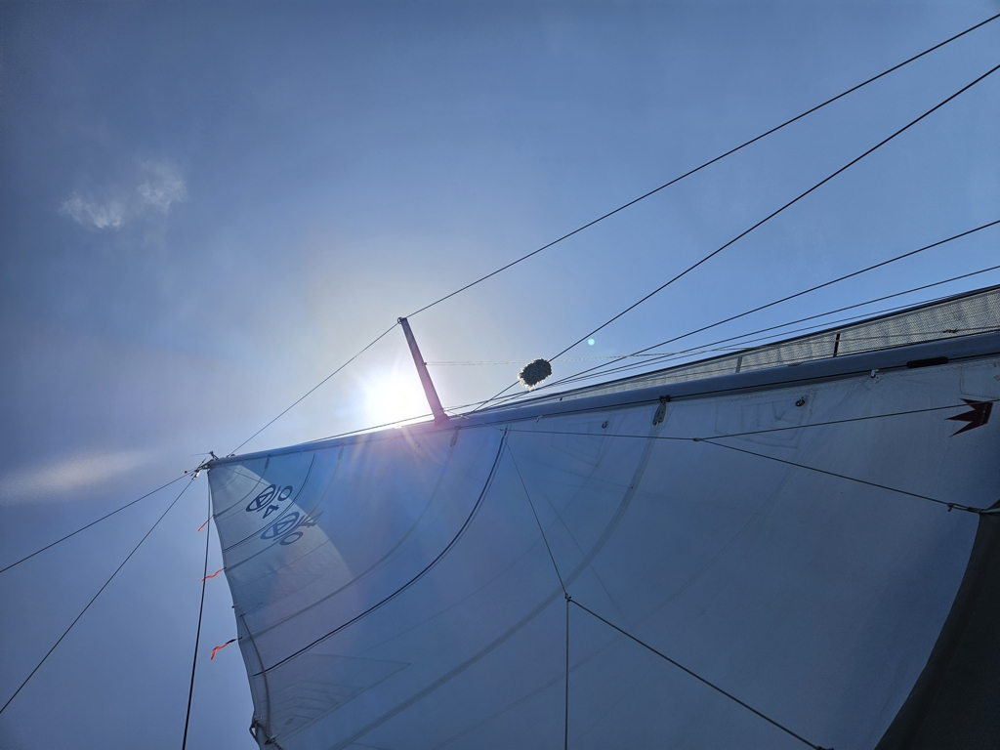

The night brought variable winds and shooting stars. The windvane kept meandering with the wind and we manoeuvred us through the main shipping lane in the darkness. Only once we needed to hail a tanker on VHF to define how they were going to pass us.

 

In the deep water we haven't seen any wildlife apart from a few birds. The calm conditions and warm sun gave us the chance to take a much needed shower. Now the boat is yet again filled with fresh smelling sailors.

 

The sea state is still moderate, but the swell period  is so long that the 2 to 3 meters are not bothering us at all. As the wind is light, the wind waves have reduced to a ripple, so we can make use of the 5 knot wind. So sailing is still continuing. It's nice to have enough food that a extra day or two at sea is not an issue. We are a sailboat afterall.

The latest forecast has the high preasure filling overnight only to reappear with the sun. We hope we can ghost along with sails, but as in the ocean always, it is the sea which decides, not us.

* Distance today: 90NM
* Total distance: 2832.8NM
* Dinner: pea soup
* Engine hours: 0
