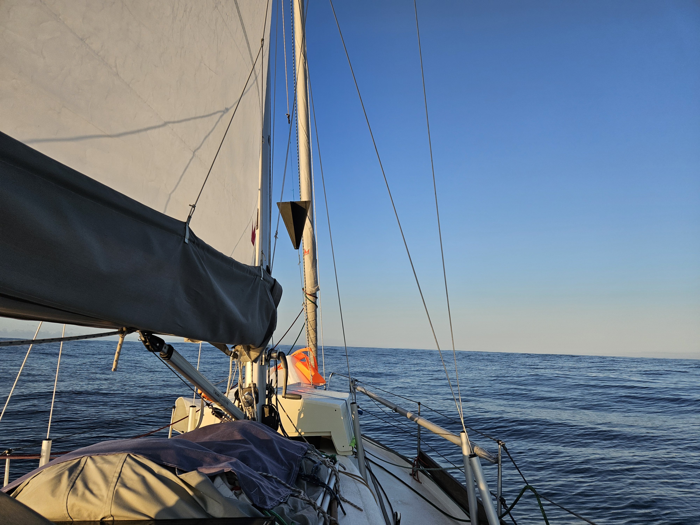
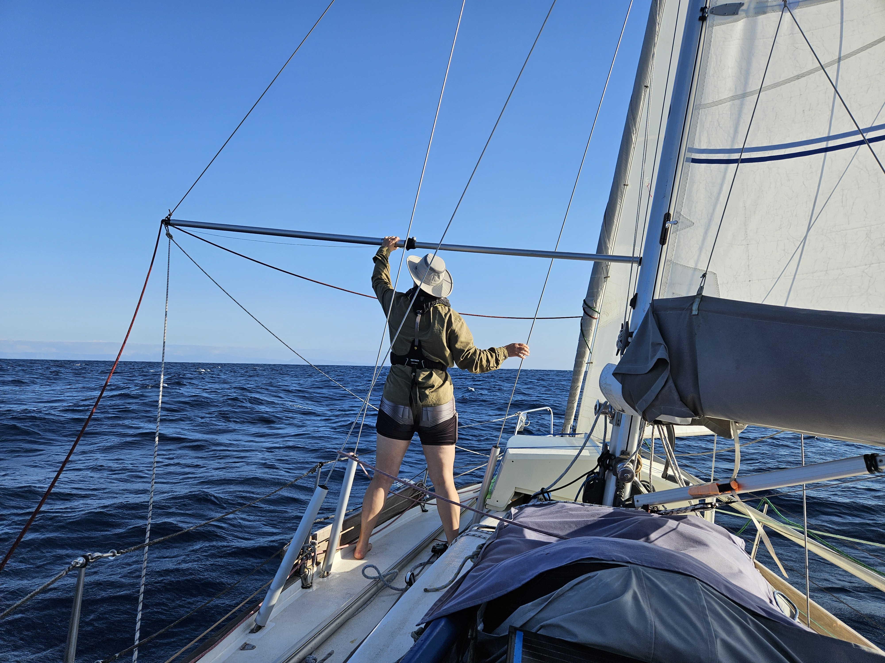

The light sailing conditions continued much further than anticipated. Just after the sunset, a couple of whales came to check us out. Big ones, seemingly bigger than the boat. In the dusk it was hard to tell the species as they blew water.

We kept ghosting along through the night, and reached the high pressure zone at sunrise. Sails went down, and we motored through the windless patch. Windless, but sadly not free of swell, making it quite a rolly few hours.

 

Once we reached the other side, we were able to start sailing with a poled out genoa. As yesterday had been spent sailing slowly instead of motoring, like weather routing suggested, it became apparent we wouldn't reach A Coruña before sunset. As we don't want another Peel Experience, we decided to slow the boat down in order to arrive at sunrise.

 

All good and well, but nearing the coastline the sea state started getting nastier, and so another change of plans was in order: hoist the staysail back on, and head for a protected anchorage just outside A Coruña, from where we can then enter the port in the morning.

* Distance today: 90NM
* Total distance: 2922.8NM
* Dinner: spaghetti aglio olio
* Engine hours: 6.9
