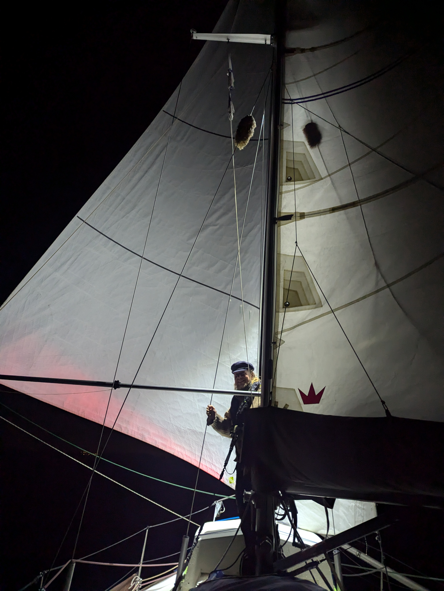
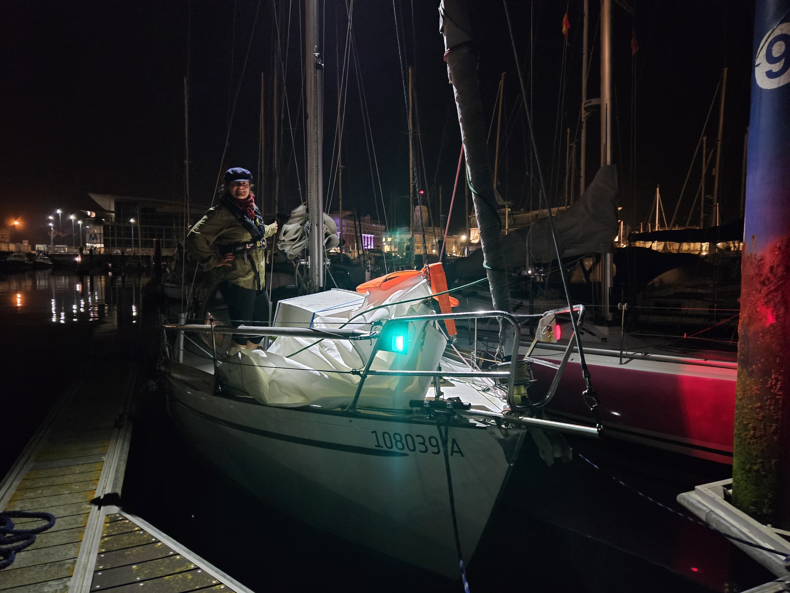

The wind kept steadily increasing until it was gusting up to 25 knots. A funnel effect of the cape Punta dos Aguillos for sure. We were absolutely flying onwards in our second reef with the staysail.

We enjoyed the last of shooting stars flying over us before the light pollution of the city slowly dimmed the night sky down. The light had thought a second benefit. We could clearly make out the wave break and still see all the directional lights. Nearing the anchorage the wind died down completely, so we weighed our options. Either come in in dark and wind still, or come in later with light and expected gusts up to 20 kn. We chose the first one.

 

Bergie called the harbour number and managed to agree on a spot in the marina even though he doesn't speak any Spanish, which was the only language the night officer was speaking. Sometimes I can just wonder how he does it.

We arrived in the marina precicely in one hour like we had said, to the great suprise of the night officer. Now we are in our berth taking in the voyage we just completed. Us, in Lille Ø over the Bay of Biscay!

 

After some sleep, we'll hit the town and go for dinner, thanks to Stephan, Martina and Karsten! Cheers to you all!

* Distance today: 40NM
* Total distance: 2962.8NM
* Engine hours: 1.4
