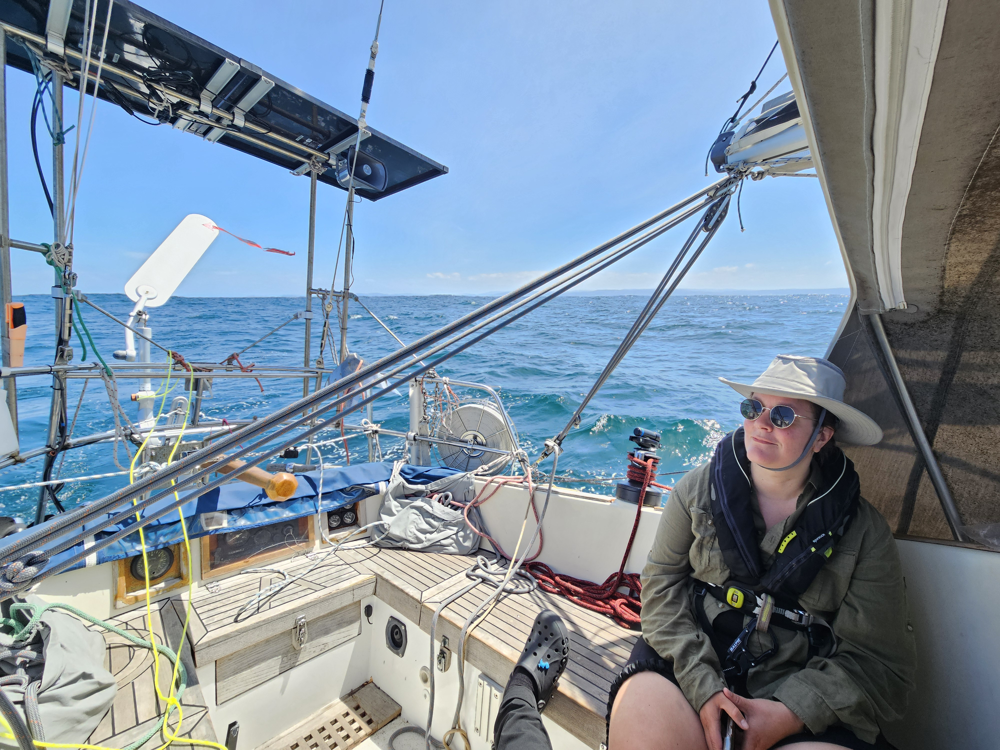
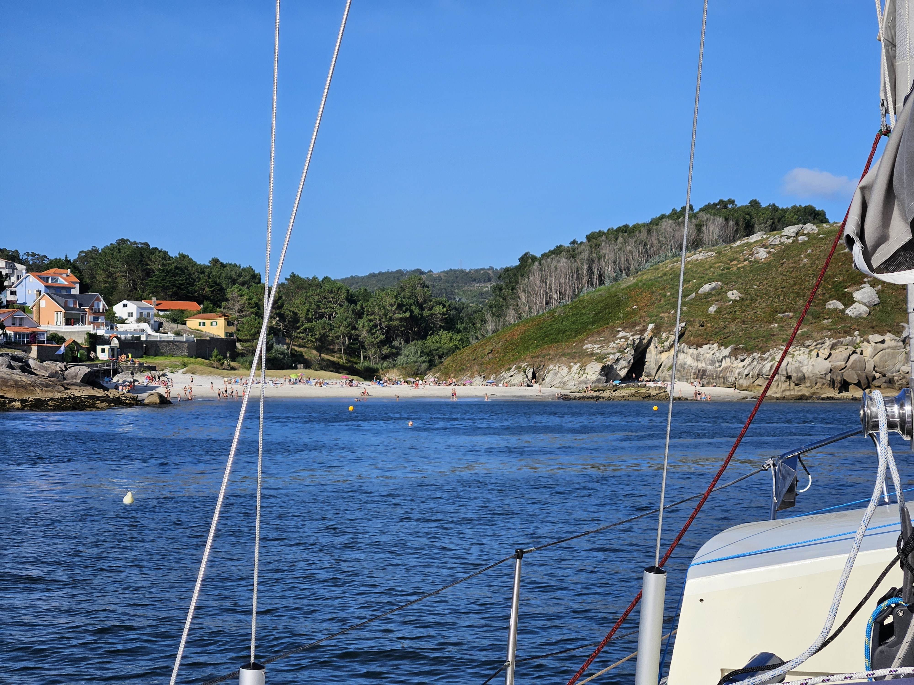

Four days went past quickly in A Coruña. We got to enjoy the local cuisine, visit a Roman lighthouse, and do a good provisioning round. As a bonus item, there were two Finnish boats in the marina that we ended up hanging out with.

But now again there were some sailing winds in the forecast, and so it was time to head west. The winds would fill in only in the afternoon, so to make some distance, we started by motoring. 

Seas were big, 2-3m, and hence going was quite rolly. But once there was enough wind to sail by, things got a lot more comfortable.

 

We were visited by dolphins on multiple occasions, including a pod of a lot bigger dolphins than the ones we've seen before. They never lingered for long, though. 

Now we're anchored off the beach in the town of Corme. Good anchorage protected by a breakwall, and accordingly quite full of boats coming from Sweden, Norway, Germany, and The Netherlands. On arrival we got to practice a "hat overboard" manouver that I'm happy to report went without problems.

 

* Distance today: 37.1NM
* Total distance: 2999.9NM
* Lunch: gazpacho
* Engine hours: 3.2
