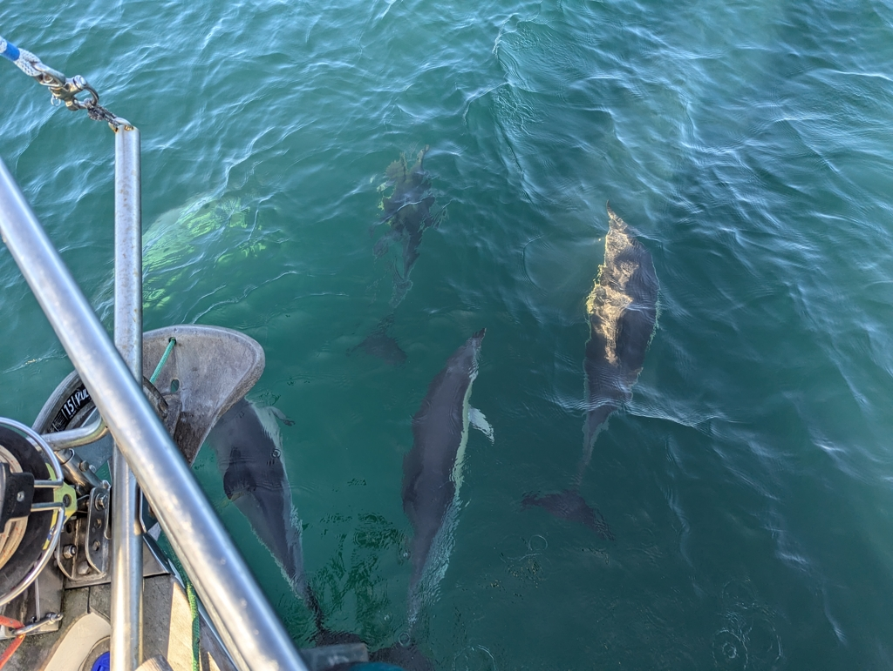

We left when the wind had picked up to about 7 knots, something we could sail. We hoisted the main sail in the small bay protected by the wave break and continued our journey towards the end of the world, Cabo Finisterre. At least that was the end of the world for the Romans.

 

As we got a bit further away from the land wind effect, we had a marvelous beam to broad reach the whole way. Dolphins came to greet us multiple times. As we were at the Cape Finisterre, the wind picked up and instead of already tucking in for the night we decided to go to the next bay, Ría de Mures e Noia. We rolled in the genoa a bit as we were going at hull speed. The current going with us meant that we were flying along with more than 7.5 knots a long time.

 

As we entered the bay, we were greeted with no waves and a very warm breeze. Now we were close reached and managed even to tack once before reaching our anchorage for the next couple days, the town of Muros. I believe Bergie intends to find some ice cream.

And thanks to Thilo, we are going to enjoy a cold beer too!

* Distance today: 54.7NM
* Total distance: 3054.6NM
* Lunch: gazpacho, this time homemade 
* Engine hours: 0.9
