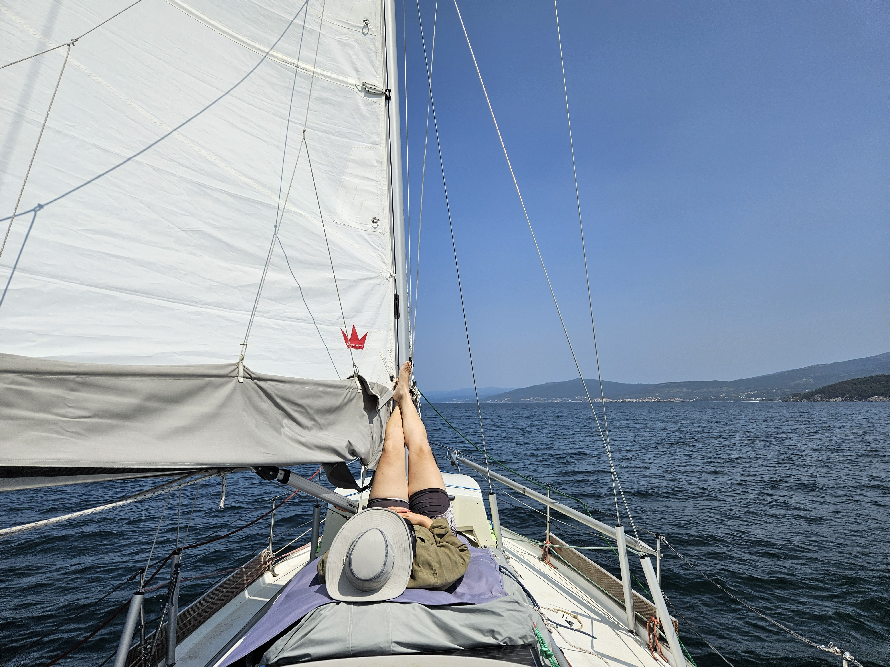
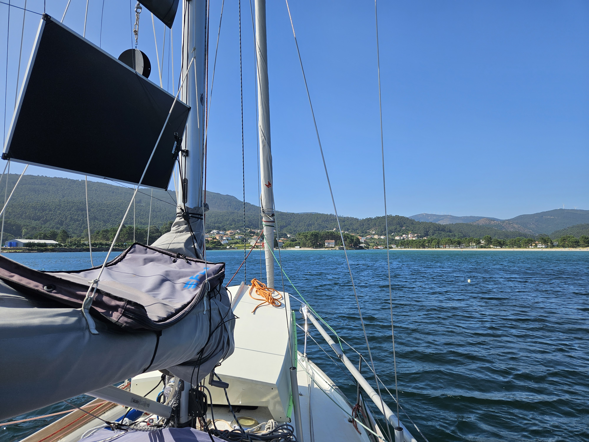

We have been enjoying life at anchor and been exploring the village of Muros and it's festivities. The rudder-munching bunch of Orcas has been reported to be some 150 south of us and moving north so we have decided to stay in this Ría until they have passed our location, which by this rate should be in 3 days.

Orcas or no, we felt like a change of scenery, so we decided to go for a little day sail. Run the watermaker in the middle of the Ría and then find another anchorage. 

As we had just gotten all of the chain up, we were intercepted by the Spanish Customs. So we dropped some chain out again and went to get the boat and personal papers. After getting the boat details we were free to go back to lifting the anchor. We hoisted the main sail and rolled out the genoa and tacked towards the Ría entrance.

 

Then we turned around and lazily sailed down wind with just the main sail up. After few hours we saw a pod of dolphins jumping around. As the dolphins were from a fairly large species, we actually needed to check that they indeed had dolphin shaped dorsal fins instead of orca shaped dorsal fins. 

We dropped the anchor in the bay where the river Rego de Rateira meets the sea. Here we have a nice breeze to keep us cool.

 

* Distance today: 9.2NM
* Total distance: 3063.8NM
* Lunch: blueberry soup
* Engine hours: 0.8
