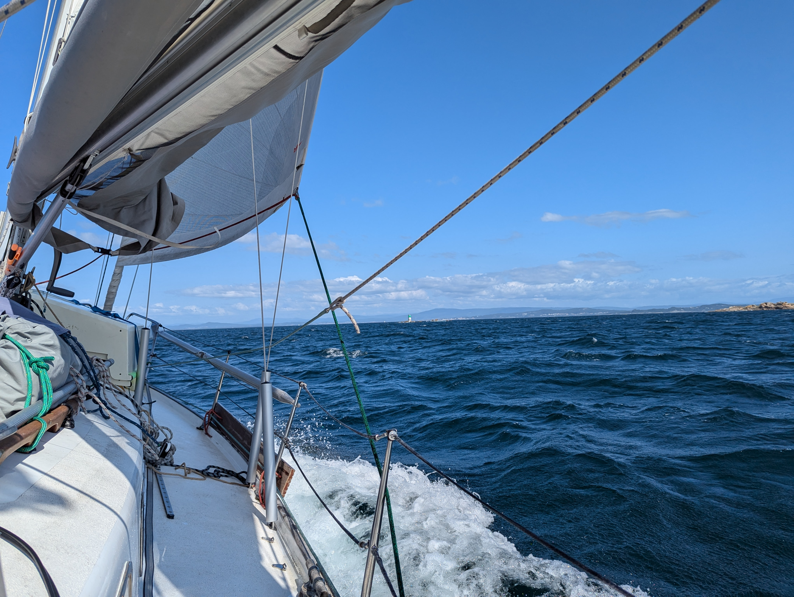

A few days went past quickly off the Bornalle beach. Some dinghy adventures under both sail and oar, and some cruiser socialising with a Finnish boat. But now the weather and orca forecasts aligned to allow us to continue.

We hoisted anchor and motored past the mussel farm before hoisting sail. Initially quite nice light conditions with the wind speeds in the low teens.
Seas were somewhat big, but of the mellow long Atlantic swell sort.

The only traffic we saw was a British traditional gaff rigger, beating its way up under full sail.

As we turned the corner to head into Ría de Arousa, wind picked up quite a bit. Soon we were blasting on a beam reach with full main at 33kt. The somewhat tricky navigation between rocks and numerous lobster pots didn't leave us a lot of room, and so we decided to live with the weather helm instead of reefing.

 

Once we got into the Ría proper, wind quieted down and the seas went flat. Now we're anchored off the beach at Palmeira, a bit north of the town of Ribeira. This Ría is the biggest one  and should provide us with places to explore for a while.

* Distance today: 31NM
