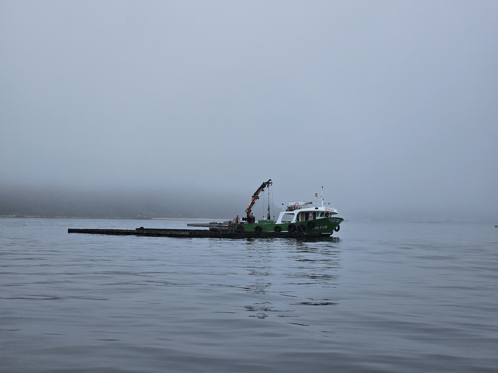

We woke up to a foggy day. As we were preparing the boat for the short ride, a pod of dolphins swam by. First time we've seen dolphins in an anchorage!

After we had the boat ready we turned on the motor and ventured out into the misty morning. With absolutely no wind we motored out of the mussel farm area and in to the harbour. We need to order some stuff, so we'll spend a week here.

 

* Distance today: 3.7NM
* Total distance: 3098.5NM
* Lunch: not yet
* Engine hours: 0.9
