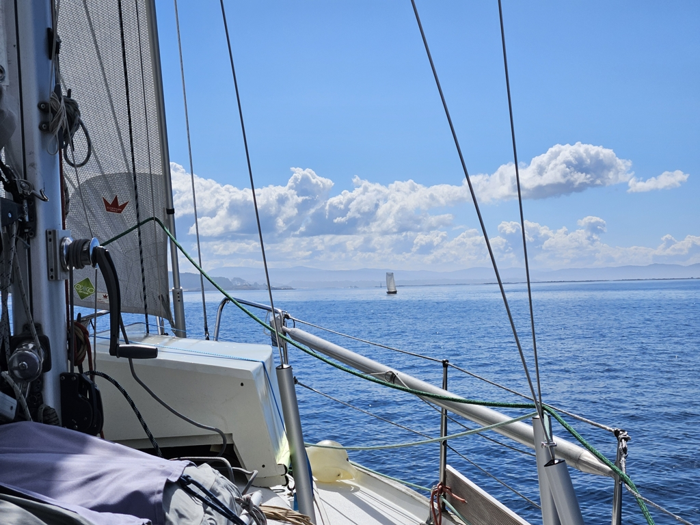

Getting packages delivered to the marina was a bit of an adventure, and one is still missing. But since they only move on weekdays, we decided to head out to anchor for the weekend. 

The morning came with a heavy fog - you couldn't even see the wave break from the pier! But by noon it had started lifting, and so we paid the marina and headed out.

 

Very light conditions for this short hop across the Ría. There were orca attacks here on Monday, but no sightings since then. Nevertheless, we kept our eyes and ears open, and tried to stick to the shallow parts.

Now we're anchored off the beach on the northwest corner of Illa de Arousa. We'll spend the weekend here, and hope the missing package arrives to A Pobra on Monday, so we can then do a provisions run and continue our journey. 

Today is Suski's birthday, so we'll celebrate that here. Kippis, Martin and Andreas M!

* Distance today: 3.2NM
* Total distance: 3101.7NM
* Dinner: Pimientos de Padrón and other tapas
* Engine hours: 0.9
