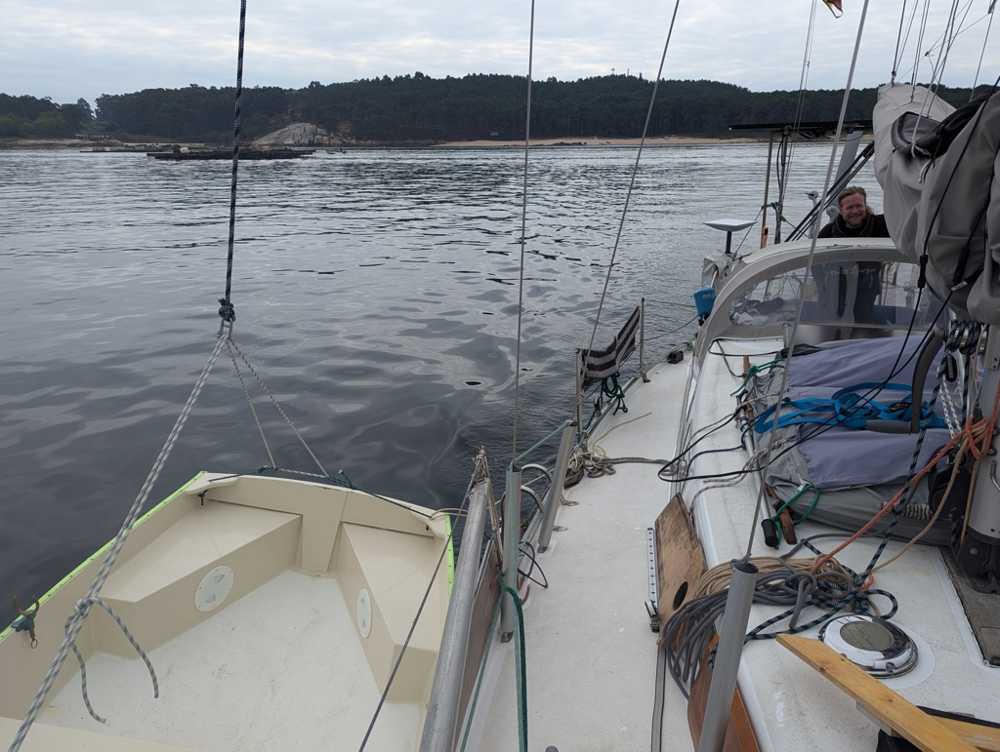

Team lazy needed to move to the other side of the Ría for tomorrow's NE wind. But as right at the moment we have no wind at all, we left FLINsails up and didn't bother to pack the dinghy properly. Anchor chain was also left on the deck ready to the anchoring on the other side.

Before we left, we could visually check that the bay we had planned for us had no boats anchoring in it, so we turned on the motor and weaved our way through the mussel farms. When we arrived, we drove our loop checking the bay out and dropped the anchor at 5 meters depth. From here it is a short row to what seems to be our private beach. 

 

The postal service is trying to locate our missing parcel, hopefully they are successful.

* Distance today: 2.6NM
* Total distance: 3104.3NM
* Lunch: spaghetti with avocado sauce 
* Engine hours: 0.9
