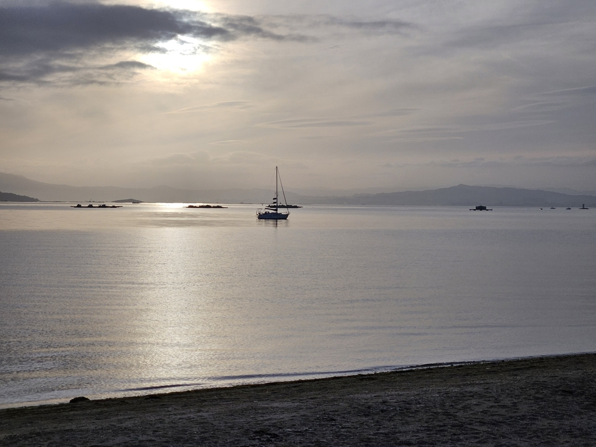

Our anchoring permits for the Illa de Ons nature reserve got approved, and this meant giving up on that lost parcel and sailing on.

 

We started the morning early, hoisting anchor just before sunrise, and motoring into the Pobra do Caramiñal anchorage. Since we'll be off the grid again in nature reserves for a few days now, it was good to do a round of groceries, laundry, and getting rid of trash. Three hours later we hoisted anchor again.

The trip south started with almost no wind. Between motoring we tried sailing a bit, but it was more just drifting. Once out of the Ría, wind started picking up and we could finally sail properly.

 

Our anchorage neighbour happened to sail out at the same time, giving a chance for some impromptu regattaing. Turns out our strategy of going dead downwind poled out was better than their gybing.

Now we're tied to a mooring off the island, and plan to head for some trails tomorrow. 

* Distance today: 17.9NM
* Lunch: empanadas
