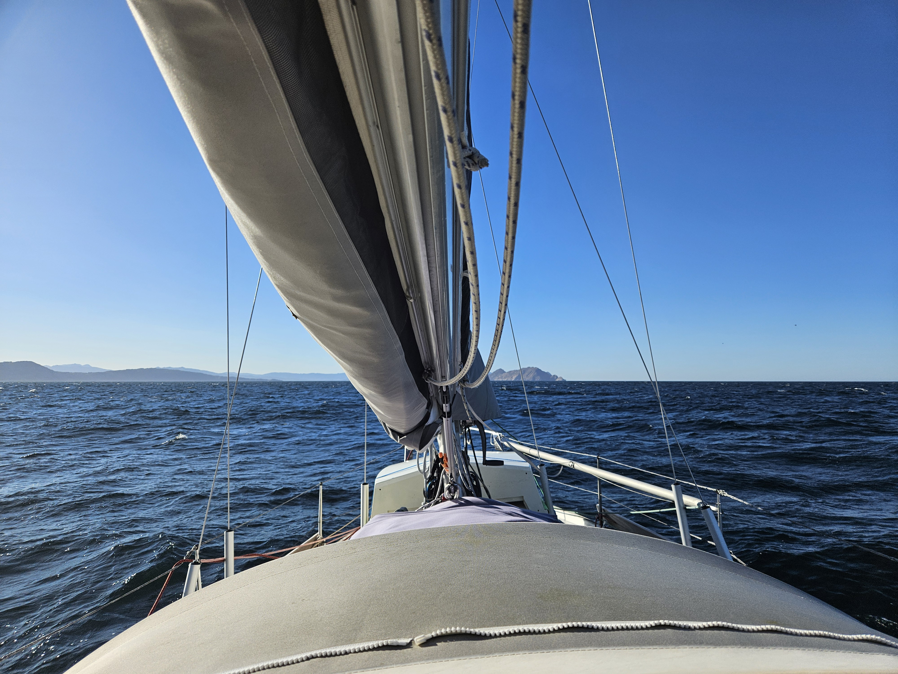

During the night wind shifted from NW to NE which made for an uncomfortable night. In the morning getting rid of the mooring line was interesting as the waves and wind made it hard to release. A complete newbie mistake but you need to make also those from time to time. 

 

We decided that two sleep deprived sailors should maybe make the 10 mile journey to the next nature reserve under engine, so we motored the uneventful journey. We are now tucked in on the southernmost anchorage on Islas Cíes. Now a small nap and then well head out to explore the island. This nature reserve is so popular that we could only get anchoring permit for one night.

* Distance today: 10.5NM
