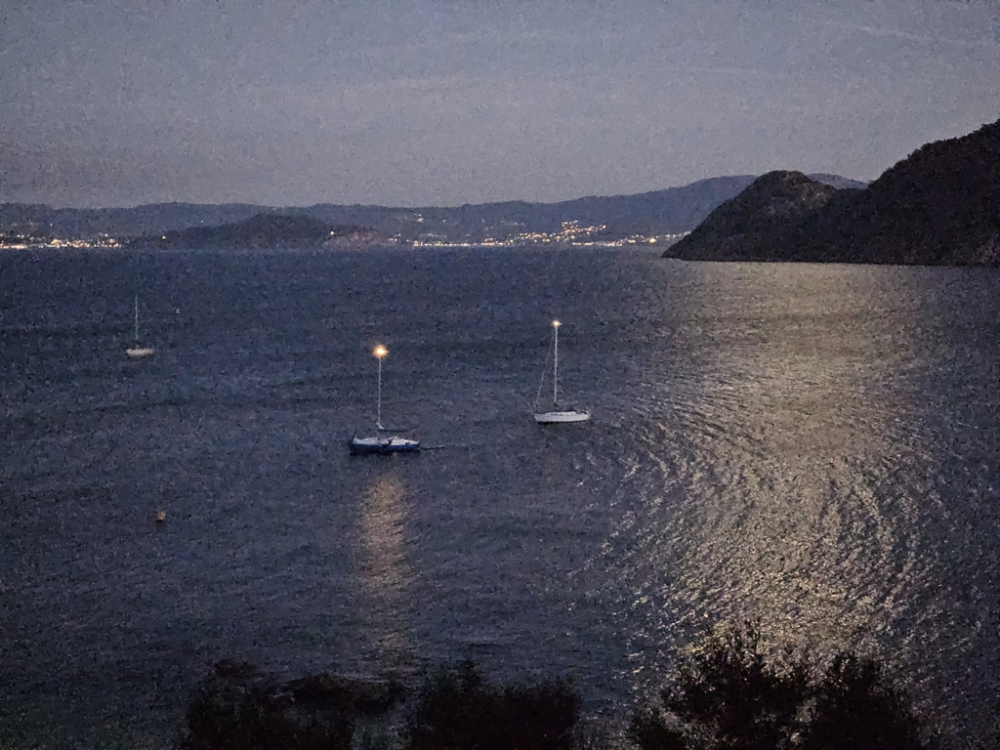
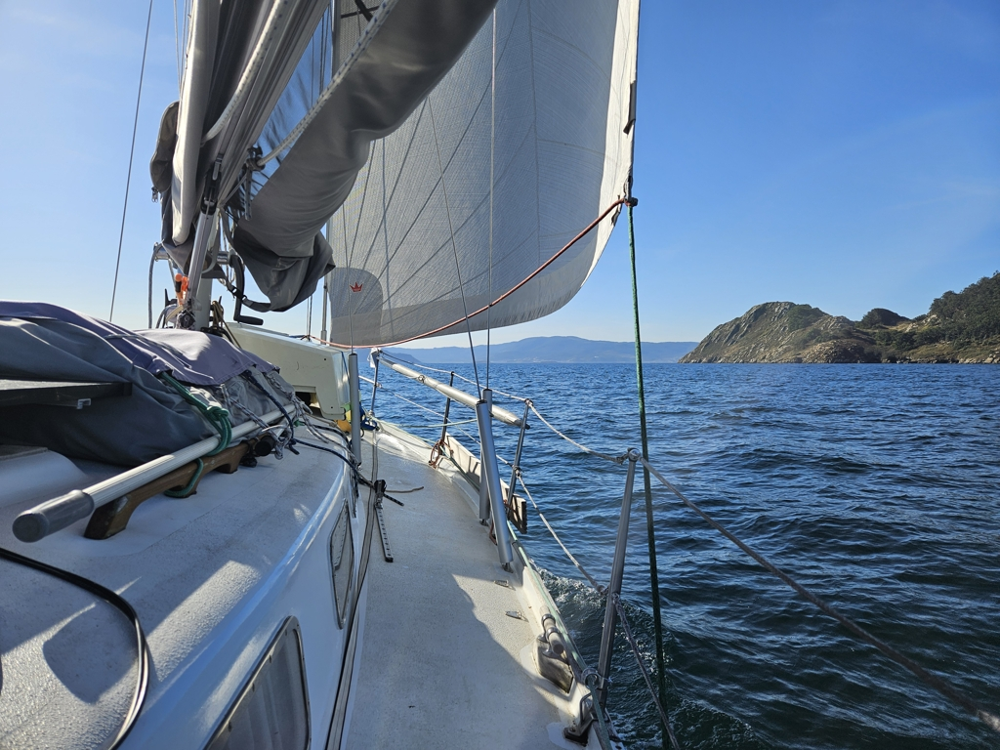

The visit to the Cíes islands nature reserve was lovely, but had to be cut short due to the anchoring permit restrictions. Yesterday we watched the sun go down from the island lighthouse, and then rowed back to Lille Ø in the dark.

 

In the morning we then made the boat ready, and sailed the short distance to the Bay of Baiona. Wind was light, and so when a tanker sped up to enter the Vigo channel, we had to motorsail to get out of its way with a comfortable CPA.

 

Now we're anchored in front of the town of Panxón. After the rolly Atlantic islands, this gave an excellent opportunity for some smaller boat maintenance tasks. Now we weigh the orca situation and the light winds on the opportunity to head further south.

* Distance today: 5.7NM
* Total distance: 3138.4NM
* Lunch: Caesar salad
* Engine hours: 1.1
