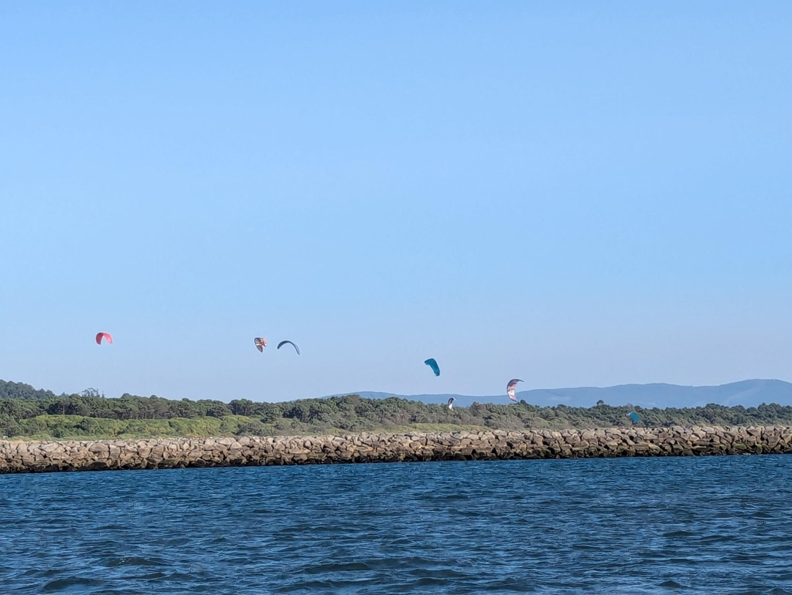

The morning started with practically no wind, so we motored out. Expecting the wind to pick up out of the bay, we hoisted the main sail while still in the shelter of the mountains. 

We are now in prime orca territory, so the plan was to hug the coast on the 20m depth line. As we turned on the north buoy, we found no wind, so we motored on.

As our water tank is 38% full, we wanted to make water even though we were motoring. We had just done a fresh water rinse for the system, so there was a lot of air in the system. So we needed to bleed air from the watermaker system, so we opened the first filter a bit and turned off the watermaker. And boom. No water from the engine exhaust anymore as it just sucked air in and created an air lock into the engine water intake. 

So engine off, opening the sea strainer to let the air out. Then closing the strainer again and starting the motor. Still no water. WTF. But I forgot to open the seacock again after closing the strainer... Opening the seacock and woohoo! Water again.

Luckily I noticed the missing water quickly. We got the motor only 10° warmer than usual during the process. 

Now motoring ahead again. 

🙈🤦‍♀😅

 

At the border we tried going into an anchorage along the Minho river, but the bar would have been too shallow on low water for us to leave in the morning, so we turned around. Eventually we found a sliver of moving air, so we pulled the genoa out, turned off the motor and sailed. Now we could also use the watermaker without fear of hindering the water intake of the motor. 

During the last hour we found wind and of course the highest gusts were right behind the wave break. And what a sight greeted us, dozens of kite, foil and wind surfers!

 

By our late arrival the official marina was already full, so we were instructed to go to the historical marina in the city center. Awesome location, though the 1km walk to the showers means that we will stink for one more day!

* Distance today: 35.5NM
* Total distance: 3173.9NM
* Lunch: Gazpacho
* Engine hours: 5.7
