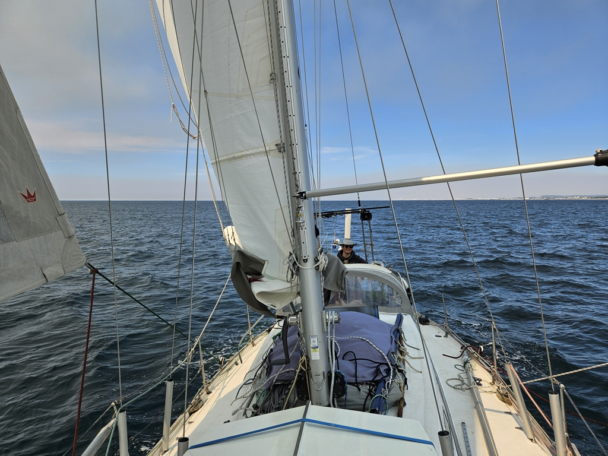
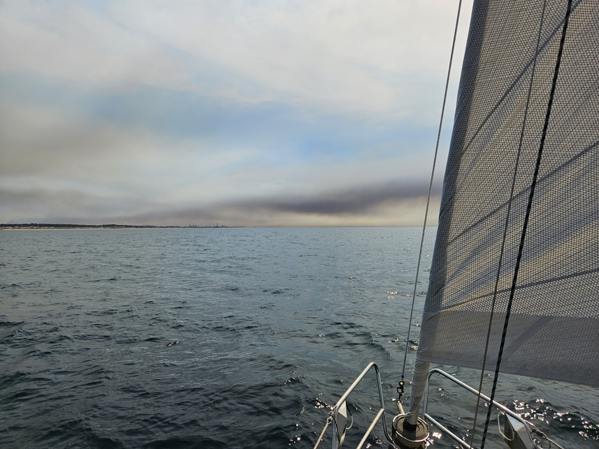

As it often is, what a difference a day makes! Yesterday we could barely sail a bit, and today instead the conditions were quire lovely for sailing the whole day.

We left the Viana museum dock in the early morning and followed the dredger ship out of the harbour. Then sails up, and soon watermaker on.

Today's scenery was made quite dramatic by the smoke from the many wildfires in the interior. We followed the coast at the recommended 20m line in sometimes quite surreal lighting, with the sunny day filtered through the smog.

We arrived to Leixões in late afternoon. This is the cheaper marina for Porto. The evening was spent swapping stories with the crew of the Finnish boat that arrived the same day. Tomorrow we'll do a bit of exploring. We will stay here in Porto at least until Thursday, weather depending.

* Distance today: 33.9NM
* Total distance: 3207.8NM
* Lunch: feta salad
* Engine hours: 1.2
