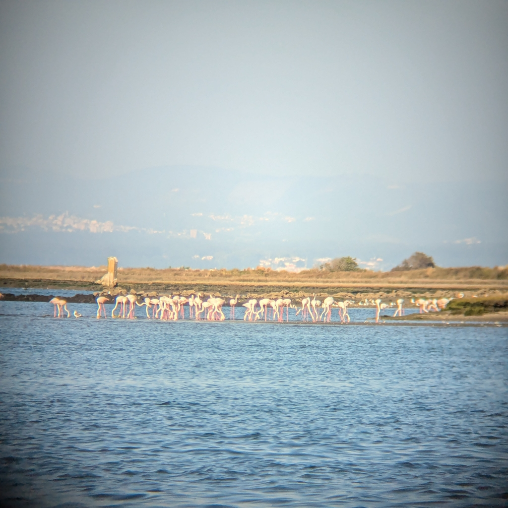

Finally, the fog had lifted and we dared to venture out of the harbour again. We motored for the first couple of hours in search of the wind and after we finally found it, we could shake the small ash particles out of the sails. While on harbour we got a fair amount of ash on the deck due to the nearby forest fires. Luckily as the windstill came, it gave the firefighters a chance to beat the flames.

 

After three hours of picture perfect sailing, we finally got the harbour master of Aveiro sailing club on the telephone and could confirm that they have a place for us. Soon after the wind died down and we motored the rest of the way. As we motored we saw pink birds on the shoreline. What? Flamingos?! A quick look with the binoculars confirmed. Flamingos. Apparently they have started nesting here. The first Portuguese offspring hatched in 2021.

 

In the harbour we had two persons waiting for us and directed us to dock aft in the wind and nose to the 1.5 knot current. We managed to squeeze us into a spot that is maybe 12 meters long, so getting in was quite exciting. Luckily we got in on the first try without hitting anything. Success!

Now well wait for a gale (from south) to pass through. The river Aveiro bar is notorious when the waves are from the sea so we will monitor the official bar openings. The bar openings are enforced with fines. To cross it when the lights are red can result into 4000€ fines. But the town of Aveiro is pretty, so we'll be fine staying.

 

* Distance today: 39.5NM
