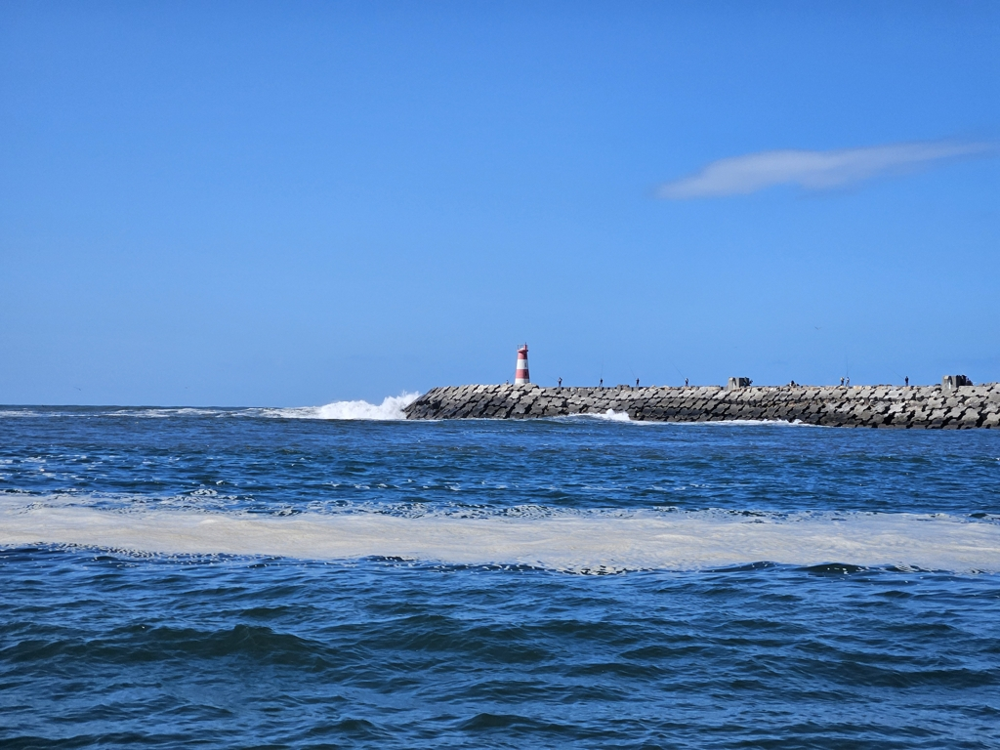
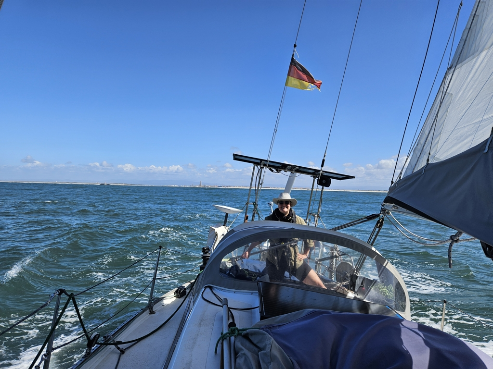
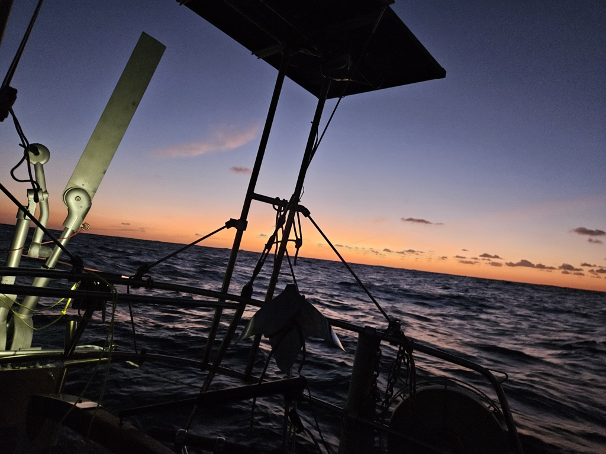

We were surprised by the Aveiro river bar opening a day earlier than anticipated. This meant we could catch this set of winds, and so we timed departure to passing the bar at high water slack.

 

As expected, the sea state outside was quite nasty. Three meter wave trains from two different far away storm systems combined to nasty rolly seas. This was the first time ever we've both been sea sick on a passage.

 

Our strategy was to head west as quickly as possible, both to get sooner to deep water where waves would be less steep, and to get past 10°W, the recommended orca avoidance zone offshore.

We passed the main shipping lanes at night without issues. We only had to radio one tanker to verify which side they wanted to pass us on.

 

As we head south the winds have become lighter and the sea state calmed. It is still rolly, but the crew is well on its way towards recovery.

Sun shines and we are making progress.

* Distance today: 152NM
* Total distance: 3399.3NM
* Dinner: Couscous salad
* Engine hours: 1.7
