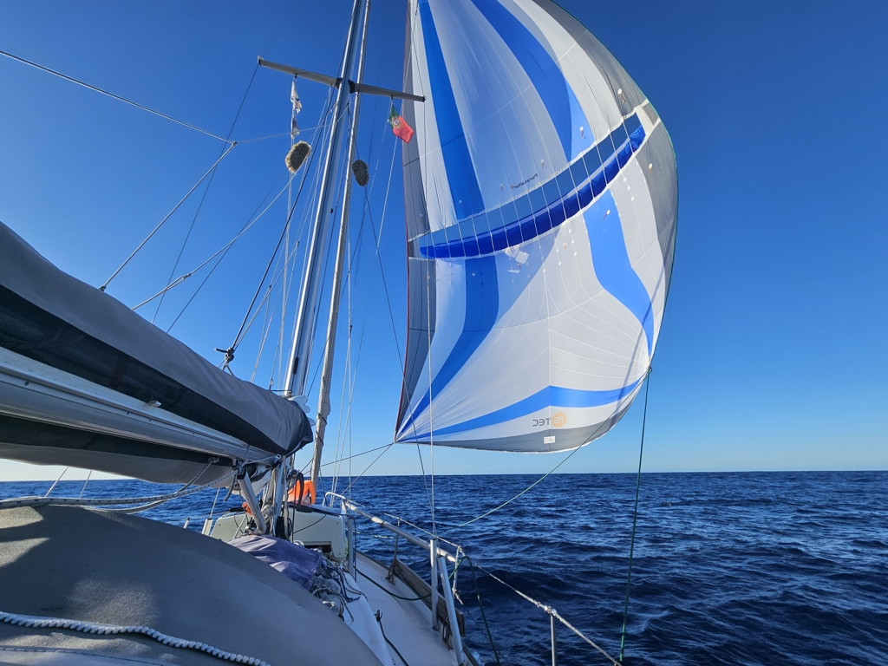
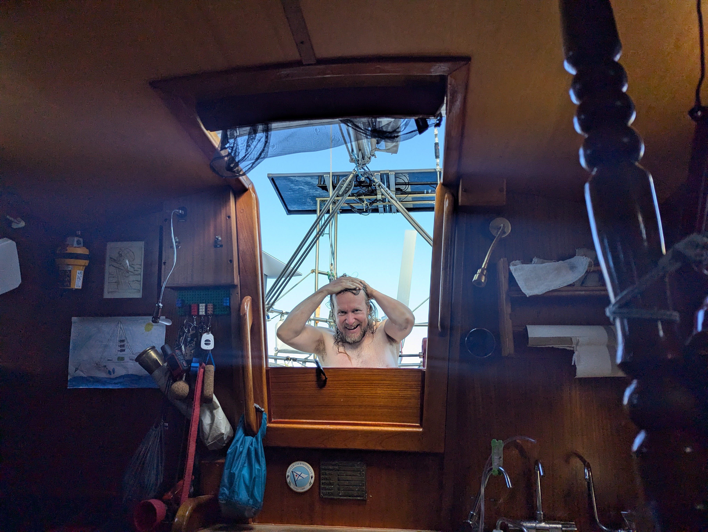

As we turned into night watches, the fishing secrets we got from a Finnish cruising couple bore fruit. Our efforts were rewarded with a nice mahimahi ust an hour after starting to drag the lure. It was promptly dispatched and filleted for today's dinner.

Due to the orca avoidance measures, our course is quite a bit more westerly than what weather routing suggested. This brought us into the high pressure ridge at night, and we had to motor to get through.

 

With the dawn the winds started returning and we could hoist the Parasailor. Going became suddenly smooth and much more pleasant. Now we could again enjoy some great, albeit slow ocean sailing. As a reward, we both had a proper freshwater shower.

 

* Distance today: 100NM
* Total distance: 3499.3NM
* Dinner: mahimahi with coconut curry sauce
* Engine hours: 9.8
