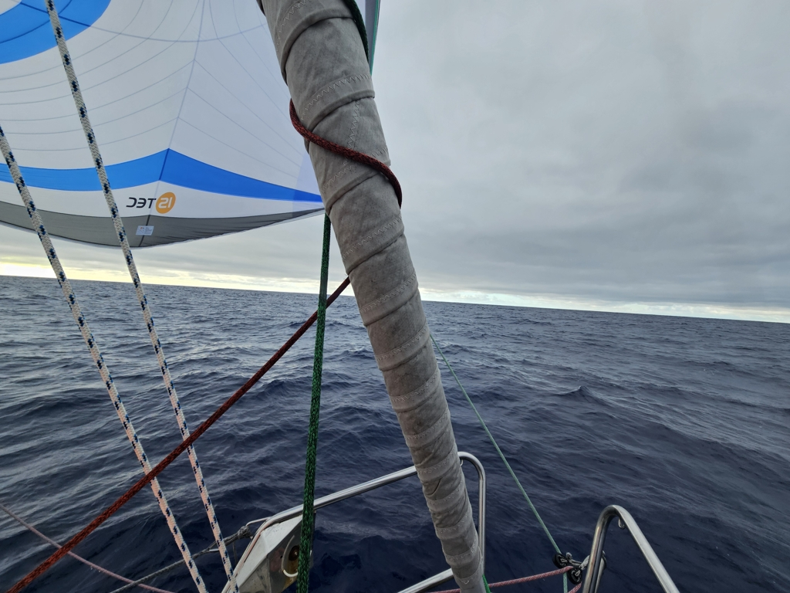

The night fell under the power of the Parasailor. With these wind angles the ride is so much smoother with it! In the darkness of the night clouds slowly filled the sky and morning rose to an overcast day.  There is some traffic around us, so keeping an eye on it passes the time on watches. As we have now truly found our sea legs again, watckeeeping is accompanied with handicrafts and reading. And in the night listening to podcasts or audiobooks.

 

* Distance today: 105NM
* Total distance: 3606.3NM
* Dinner: Finnish macaroni casserole 
* Engine hours: 0
