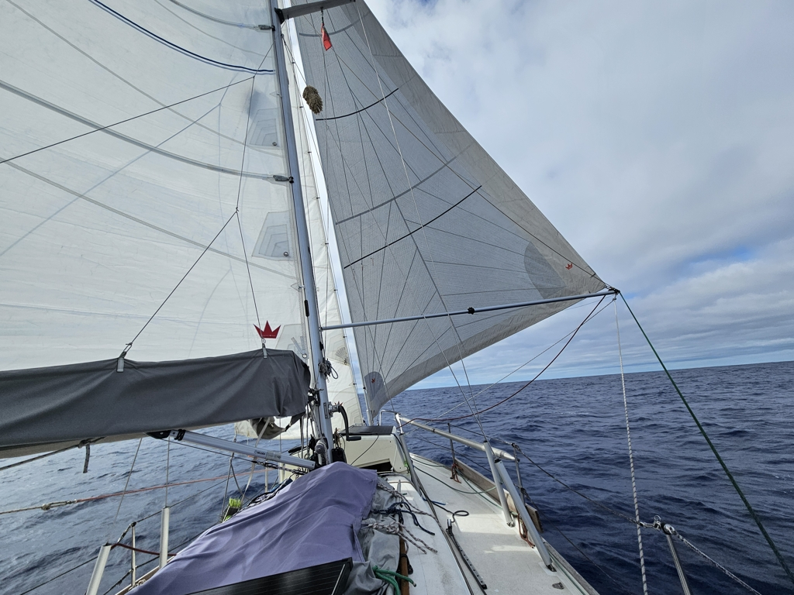
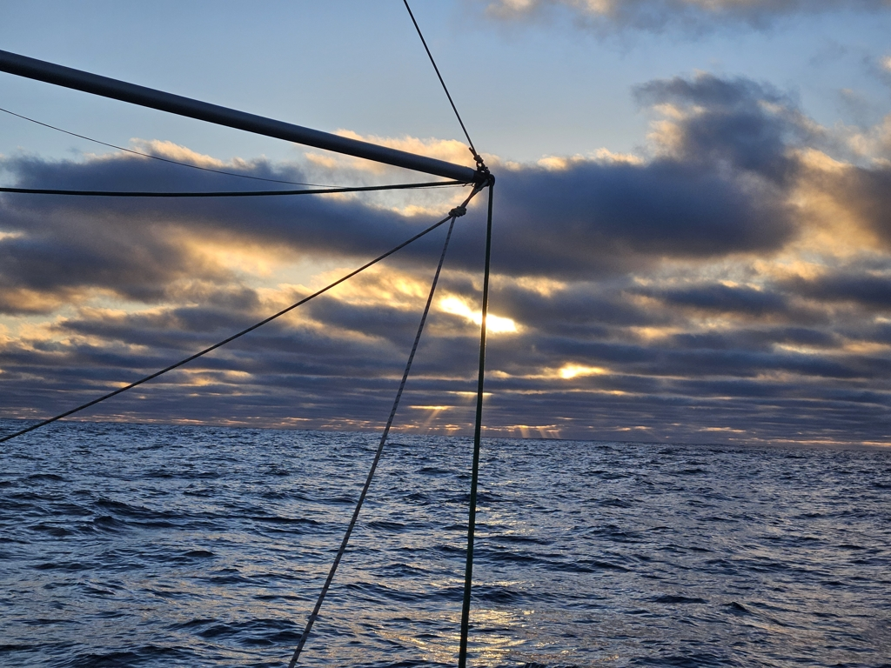

After dinner the wind picked up enough that we could finally steer with the windvane. What followed was a quite exhilarating night sail under the spinnaker with rising winds. At the 2am watch change we decided the drop the Parasailor, and went directly for the staysail. Another moment when I was happy we'd fitted the new deck light in Berlin!

 

By morning things had moderated, and we decided to test a sail configuration we've seen in some books: poled out genoa and main sail, with a tightly sheeted staysail as a stabilising factor. Seemed to work nicely, but needed winds to stay above the 10-11kt range. Felt great to have so much canvas up.

  

Just before sunset we found ourselves in an unforecasted wind hole, and so we're now motoring again. That's not a total loss, though, as we also need some more juice into the batteries after a couple of overcast days. Sea water pump now outputs warm water, telling us that we're finally south.

* Distance today: 114NM
* Total distance: 3720.3NM
* Dinner: spaghetti with avocado sauce 
* Engine hours: 1
